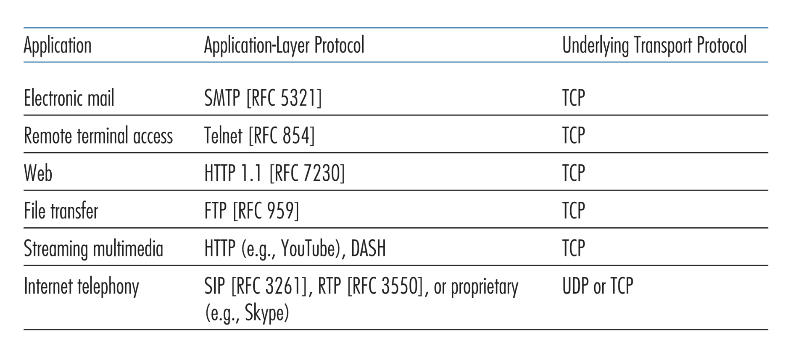
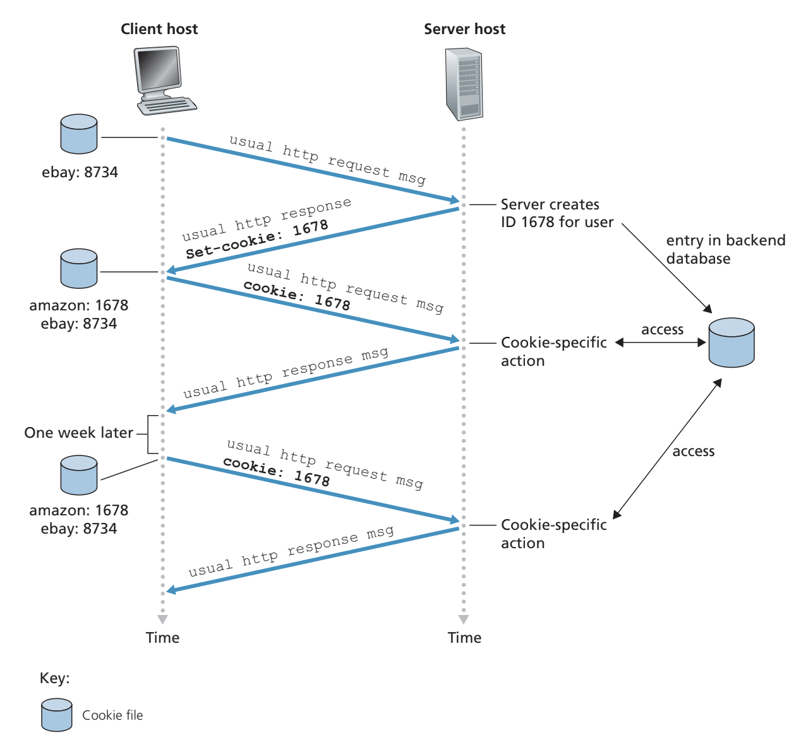
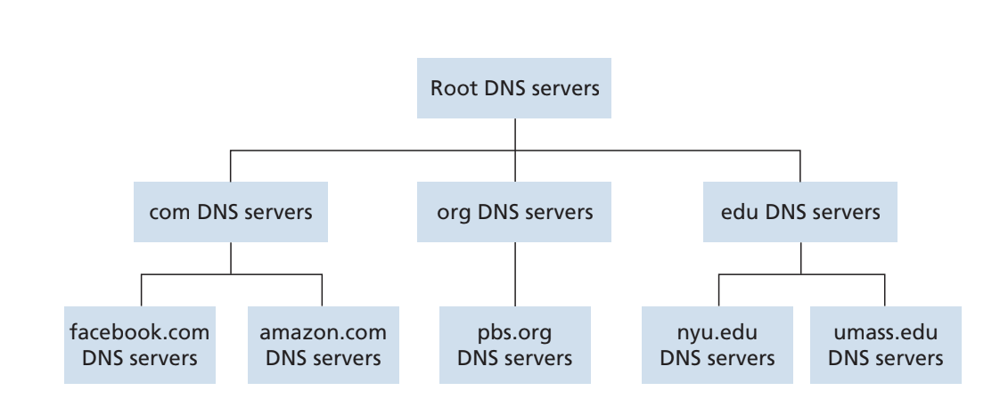
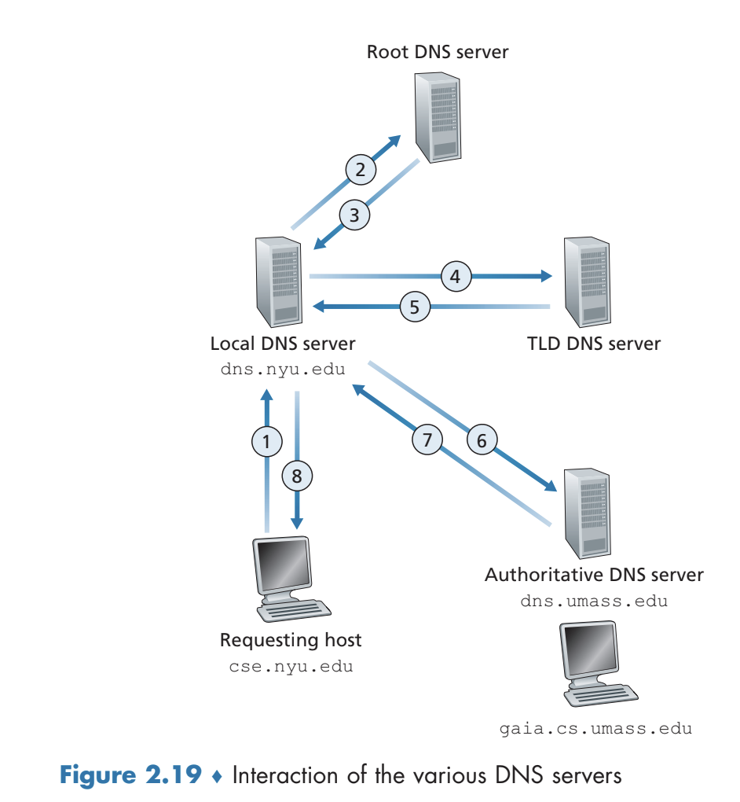
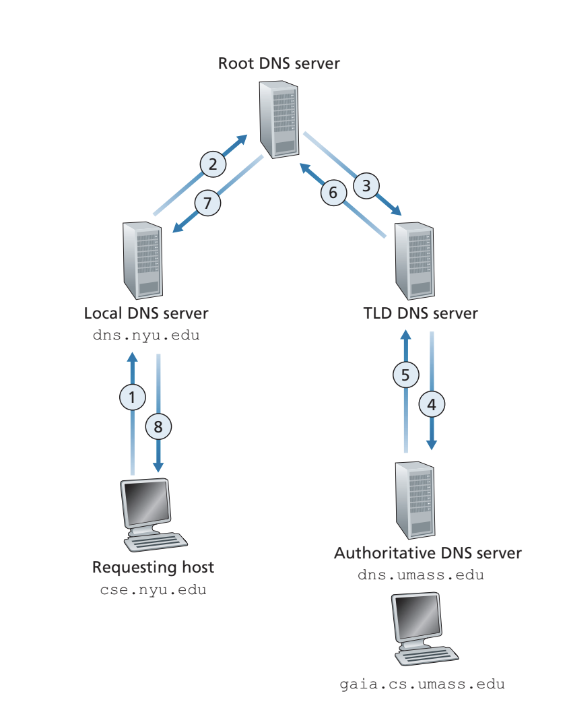
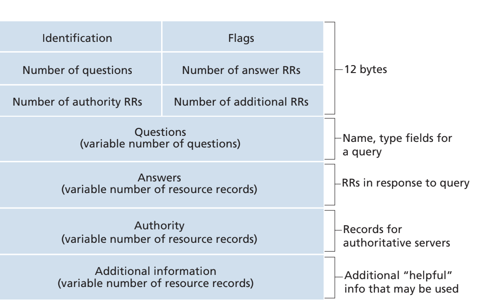
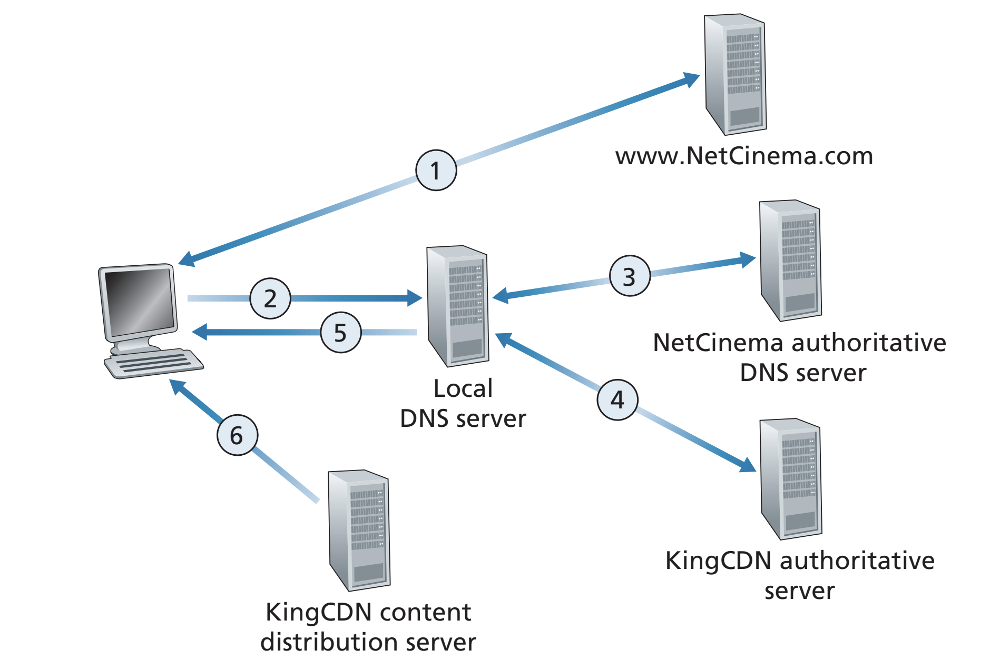

# Application Layer
## Principles of Network Applications
- When developing a network application, one must write software that runs on multiple end systems
  - This is *not* the same as writing software that runs on network-core devices
  - Rather, the software is often written in high-level programming languages such as C++, Java, or Python
- In a sense, communication for a network application takes place between end systems *at the application layer*; there is not much of a concern, from the network application-perspective, of the lower layers
### Network Application Architectures
- In a **client-server architecture**, there is an always-on host known as the *server* which services requests from other hosts, known as *clients*
  - E.g. A Web server services requests from browsers running on client hosts
  - In this architecture, clients do not communicate directly with each other but rather communicate *through the server*
  - The server typically has a fixed, well-known *IP address* so that the client can always contact the host by sending a packet to this IP address
  - It is typically the case that there is not one server but rather *multiple servers* to keep with data load - these servers are typically housed in **data centers**
  - Client-server architecture is prevalent with Web, FTP (file transfer protocol), Telnet, and e-mail applications
- In a **peer-to-peer (P2P) architecture**, there are no (or minimal) dedicated servers but instead the application exploits *direct communication* between intermittently connected hosts (known as *peers*)
  - This approach is advantageous because it offers **self-scalability** since each peer adds to the service capacity of the system (in addition to requesting, each peer also performs work by servicing)
  - This type of architecture is also more cost-effective since there is no need to spend money on dedicated servers
  - Despite these benefits, they suffer from issues of security, performance, and reliability due to the inherent decentralization
### Processes Communicating
- Within end-systems, it is not actually *programs* that communicate with each other but rather *processes*
- Under the *same system*, interprocess communication is handled by the operating system
- Between processes running on *different hosts*, processes communicate by exchanging **messages** across the computer network
- In the context of communication, the process that *initiates the communication* is known as a *client* whereas the process that *waits to be contacted* is the *server*
  - In *P2P*, a process can be both a client and a server but in general the process that asks for a file is the client (and the process that is to send this file is the server)
- Processes send messages into and receive messages from **sockets**, which is the *API* between the application layer and transport layer within a host
  - An application developer has control of everything on the application-layer side of the socket but cannot control the transport-layer side - other than being able to set a few parameters such as the choice of transport protocol
  - Multiple socket connections can be open at a time (as to connect to multiple hosts, or have even multiple connections to the same host)
- To send a message to a particular destination, an **IP address**, which is a 32-bit (now 64-bit) quantity that uniquely identifies a host, and a **port number**, which identifies the receiving process *within the host device*, is necessary
  - A host could be running *many* network applicatons, hence why indicating a specific port number is important to identify the correct application being communicated with
  - By default, a Web browser will try to contact port 80 (associated with HTTP)
### Transport Services Available to Applications
- When considering which transport layer protocol to use via the socket interface, there are many factors to be aware of
- One concern is **reliable data transfer** - that is, if a protocol provides a guarantee of data delivery, even in the case of packet loss or corruption
  - Many applications, such as Web document transfer or email, depend on this reliability
  - Some applications, however, are **loss-tolerant** and can stand to deal with some amount of data loss (as with audio or video applications)
- Another concern is **throughput** - whether an application can be guaranteed a certain throughput of $r$ bits per second
  - Some **bandwidth-sensitive** applications need certain throughput requirements - such as internet telephony or video conferencing
    - However, some applications use adaptive encoding techniques to encode digitized voice or video at a rate that matches the currently available throughput
  - **Elastic applications** can make use of as little or as much throughput as is available - examples include Web documents and email
- Yet another concern is **timing guarantees**
  - e.g. A guarantee that every bit sent arrives at the receiver no more than 100ms later
  - Realtime applications such as online games or telephony depend on these timing guarantees
- Another concern is **security**, such as ensuring that data sent is *encrypted*
### Transport Services Provided by the Internet
- The network layer provides two transport protocols - TCP and UDP
- **TCP** is connected-oriented and ensures data reliability
  - The client and the server exchange transport-layer control information *before* the application-level messages flow; this **handshaking process** establishes a TCP connection between the sockets of the two processes
    - The connection goes both ways
    - Flow control ensures the sender does not overwhelm the receiver
  - There is also a congestion-control mechanism that throttles a sending process when the network is congested between the sender and the receiver
    - This is different from flow control as flow control throttles based on *endpoints* whereas congestion control throttles based on *network core*
  - An extension to TCP is known as **Transport Layer Security (TLS)**, which adds on to TCP security services such as encryption, data integrity, and end point authentication
    - The TLS socket will encrypt data before passing it through the TCP socket, and then the receiver TLS socket will decrypt the data before passing is through the receiver's TCP socket
- **UDP** is more of a lightweight protocol, notably being connectionless and unreliable
- The two mentioned transport protocols can deal with reliability and security, but they give no guarantees in regards to throughput or timing
  - Despite the lack of these guarantees, many services that depend on these guarantees are still able to work properly because they have been designed with these limitations in mind
- 
### Application Layer Protocols
- An **application-layer protocol** defines how an *application's processes* pass messages to each other, such as the types of messages exchanged, the syntax of messages, the semantics of fields, rules for how to send and respond to messages
  - A common, publicly available application-layer protocol is HTTP
  - Open protocols are typically defined in RFCs - everyone has access to the protocol definition, which allows for ease in interoperability
  - Other applications may have proprietary protocols
- An application layer protocol is only one *piece* of a network application - specifically, a piece that governs how to communicate with other applications
## The Web and HTTP
### Overview of HTTP
- The **HyperText Transfer Protocol (HTTP)** is implemented via two programs: a client program and a server program
	- The two talk to each other via HTTP messages, with the protocol itself defining the structure of the messages and how they are to be exchanged
	- **Web browsers** implement the **client side** of HTTP whereas **Web servers** implement the **server side** of HTTP (they actually host the data referenced by the URLs)
- The Web consists of **Web pages**, which consist of **objects** that are simply files (HTML, JPEG, .JS, .CSS, etc.) and are addressable via URL
	- Web pages typically consist of a **base HTML file** and several referenced objects from that file
- When a user requests a Web page, they send an HTTP request for the object to the Web server, which then responds with an HTTP response message containing the object corresponding to the Web page
- HTTP relies in TCP as its underlying transport layer protocol - this means that an HTTP client must first initiate a TCP connection with the server before proceeding further
	- After the handshaking process, the browser and server send HTTP messages through the socket interface
	- The main advantage to using TCP as the foundation for HTTP is the guarantee of reliability - the HTTP protocol itself does not need to concern itself with the potential of data loss since TCP covers this
- HTTP is a **stateless protocol**, meaning it does not maintain any information about its clients
### Non-Persistent and Persistent Connections
- **Non-persistent** HTTP connections send each request/response pair over *separate* TCP connections
	- To make a request for an object, the client must first *initiate* a TCP connection to the server (port 80) and *then* (after the connection is established) send the HTTP request (via its socket) and wait for the response (received via its socket)
	- Under non-persistent connection, after a response is received, the client *closes* the TCP connection, and thus further HTTP requests must *reopen* the connection before making the request
	- The **round-trip time (RTT)** (time for a packet to travel from client to server and from server back to client) associated with this approach is *double*
		- There is one round-trip to handshake the TCP connection, as the client must wait for the server's acknowledgement of the connection
		- There is another round-trip for the actual request itself (client sends the request, and then the server returns the request)
- **Persistent** HTTP connections *leave the TCP connection open* after sending a response
	- Multiple requests can be sent back-to-back by the client, without needing to wait for a response
		- This allows for the client to parse the HTML file and send requests for all of the reference object files without incurring the extra RTT delays associated with closing and opening TCP connections (as with non-persistent connections)
	- HTTP servers will typically close a connection if it has not been used for a certain period of time
### HTTP Message Format
- HTTP Request:
	- Example:
		-     GET /somedir/page.html HTTP/1.1 \r\h
		      Host: www.someschool.edu \r\n
		      Connection: close \r\n
		      User-agent: Mozilla/5.0 \r\n
		      Accept-language: fr \r\n
		      \r\n
   - The first line is known as the **request line**, and it specifies the request method (GET, POST, HEAD - similar to GET but leaves out object, PUT, DELETE), the URL, and the HTTP version
	   - The URL is relative to the host
   - There are subsequent **header lines**
	   - The host line indicates the host at which the object resides (which is necessary despite there being a TCP connection in the case of web proxies)
	   - The connection line indicates that the connection should be closed after the response
   - In addition to header lines, there may also be an **entity body** which contains the data to be sent to the server (such as a form)
	   - The body is typically empty with the GET method and is populated with POST or PUT
		   - The GET method can still send data, though, by encoding such data in the URL - e.g. `/animalsearch?monkeys&bananas`
 - HTTP Response:
	 - Example:
		 -     HTTP/1.1 200 OK
			   Connection: close
			   Date: Tue, 18 Aug 2015 15:44:04 GMT
			   Server: Apache/2.2.3 (CentOS)
			   Last-Modified: Tue, 18 Aug 2015 15:11:03 GMT
			   Content-Length: 6821
			   Content-Type: text/html
			   (data data data data data ...)
	- The first line is an **initial status line**, which specifies the protocol version, a status code, and the corresponding status message
		- Common Codes: 200 OK, 301 Moved Permanently (new URL is specified in location and the client automatically re-requests), 400 Bad Request, 404 Not Found, 505 HTTP Version Not Supported
	- There are still header lines
		- Last-Modified is relevant for determining stale caches
### User-Server Interaction: Cookies
- Although HTTP is stateless, **cookies** can be used to keep track of users and therefore serve content as a function of the user
- Typically, there is a cookie header line in the HTTP response message, which is sent by the server to the *client*
	- This cookie is stored by the client's system, managed by the browser
		- It is also stored by the server via a database (associating a user with a cookie)
		- The cookie is generated by the server and given to the client typically when there is a request *without a cookie* (so the server knows that the user has not been associated with one yet)
	- Subsequent responses by the client to that specific server includes this cookie in the header of the HTTP request message
	- 
- Cookies can be used to track users, as a server can determine which web pages a user visits based on the requests associated with their cookie identifier
	- If a user registers to the website, then their personal information (name, email, etc.) can be used to even further identify the user in relation to their cookie identifier
	- **Third-party cookies** can also be used to track user behavior across multiple websites without the user ever choosing to visit the tracker site
		- A website of which a user visited and acquired a **first-party cookie** from may refer a third-party company (typically ad companies), and this first-party company will give a cookie to the user on the third-party company's behalf
		- This third-party cookie can then track the user on other websites where they are also referred on (so websites where the company may run ads on)
		- With this information, the third-party cookie company provides the data to the first-party provider, which they can use to provide targeted advertisement information based on the user's web browsing habits
	- For this reason, cookies are controversial since there are concerns regarding selling the data associated with the users and their online activity
		- Some browsers have disabled third-party cookies
		- In the European Union, cookies that can identify an individual are considered personal data and are therefore subject to GDPR personal data regulations
### Web Caching
- A **Web cache** or **proxy server** is a network entity that satisfies an HTTP request on behalf of an origin Web server
	- The Web cache keeps a disk storage of recently requested objects
- A user's browser is typically configured so that a request for an object is first directed to the Web cache
	- The browser establishes a TCP connection with the Web cache and then sends an HTTP request for the object to the Web cache
	- The Web cache checks if it has the object in its local storage - if so (and it is not stale), it sends an HTTP response with the object
		- If it does not have the object, it opens a TCP connection with the origin server, sends an HTTP request for the object, and finally sends this object back  after receiving it
			- The Web cache also stores a copy of this object in its local storage
- Web caching can substantially reduce the response time for a client request, especially in cases where the bottleneck bandwidth between the client and the origin server is much less (worse) than the bottleneck bandwidth between the client and the proxy
	- This is because the Web cache is able to allow for more *hits* that are quickly delivered - thus, the remaining misses overall result in less connections to the origin and thus serves to reduce traffic
- To account for the potential issue of stale caches, the **conditional GET** mechanism is utilized
	- This involves a GET message with a `If-Modified-Since` header
	- The Web cache, when storing objects, also stores the last-modified date, and, upon future request of an object, sends a conditional GET with the stored last-modified date
		- If the origin server responds to the cache that the object has not been modified, then it goes ahead and sends its cached copy to the requester
		- Otherwise, if the object has been modified, the cache will fetch a fresh copy, store it, and return that copy to the requester
- Example: Consider an access link rate of 1.54 Mbps, the RTT from an institutional router to the server being 2 seconds, the web object size being 100k bits, and the average request rates from the browsers to origin servers being 15 req/sec
	- The average data rate to browsers is 1.50 Mbps ($15 * 100k$ bits), and so the access link utilization is ($1.5 / 1.54  = 0.97$)
		- There are very high queueing delays
	- The end-end delay is the Internet delay + access link delay + LAN delay, and since the access link delay is very congested, it will contribute most to the end-to-end delay
	- One approach can be to buy a faster access link, but this is very expensive - a different approach, which is less expensive, is to install a web cache
		- If the cache hit rate is 0.4, then only 60% of requests need to be satisfied over the server: $0.6 * 1.50 Mbps = 0.9 Mbps$, so the new access link utilization is 0.58 (0.9 / 1.54)
### HTTP/2
- HTTP/2 was introduced with the goals of enabling request and response multiplexing over a *single* TCP connection, providing request prioritization and server push, and provide efficient compression of header fields
	- HTTP/1 typically uses persistent TCP connections, but most Web pages suffered from an issue known as **head of line (HOL) blocking**
		- Under a single TCP connection, if there is a bottleneck link, then a request for a large object (such as video clip) followed by requests for small objects would result in the small objects being delayed 
		- Under HTTP/1, browsers circumvented this issue by opening multiple, *parallel* TCP connections
	- TCP's congestion control mechanism, which aims to give each TCP connection sharing a bottleneck link *equal share* of the available bandwidth of the link, also resulted in many browsers running HTTP/1 to "cheat" more bandwidth by opening more parallel connections
- The HTTP/2 solution to the HOL issue is to break each message into *frames* and then interleave response and request messages on the same TCP connection
	- This allows for the small objects to be interleaved *alongside* the larger object rather than delaying them until the larger object fully sent
	- Framing is done by a sublayer of HTTP/2 - the server's framing sublayer breaks down the response into frames, which are sent and interleaved with other frames via the single TCP connection, and when the client receives the frames, its framing sublayer reassembles the original response
- HTTP/2 also contains *message prioritization*, so developers can customize the relative priority of messages so that the server can send first the frames with higher priority
	- The client can also state the dependency of messages (on other messages) so that these dependencies are accounted when the server sends frames
- HTTP/2 also implements *server push*, where a server can send *multiple* responses for a single client request (without needing to wait for the client to send multiple other requests)
- HTTP/3 is currently being discussed, with the intention to replace the underlying transport layer protocol with UDP rather than TCP
	- The goal is also to add security, per-object error- and congestion-control
## Electronic Mail in the Internet
- Email makes use of the **Simple Mail Transfer Protocol (SMTP)**
	- **User agents** (such as Outlook, Gmail, etc.) allow users to read, reply to, forward, and send messages to the **mail server**, which are placed in the server's outgoing mail queue to be sent *directly* to another mail server - from which the recipient user retrieves the message from their corresponding mailbox
- If the mail servers cannot immediately deliver mail to the recipient server, the message is held in the **message queue**, where it is periodically attempted to be resent (for a certain number of times)
- SMTP utilizes TCP connections to transfer from the sender's mail server to the receiver's mail server
### SMTP
- SMTP is a old protocol, so it is bound by certain legacy restrictions - such as requiring all mail messages to be simple 7-bit ASCII
	- Today, this requires binary multimedia data (e.g. images) to be encoded into ASCII before being sent, and then decoded back into binary upon being received
- In general, the SMTP process involves the user instructing the user agent to send a message, which then sends this message to the mail server where it is placed in message queue
	- The mail server sees the message in the queue and opens a TCP connection to the recipient SMTP server
	- After the handshaking process, the SMTP client sends the message, which is received by server
	- The recipient of the message will receive the message in their mail box and, on opening their user agent, is able to read the message
- SMTP typically does not use intermediary mail servers - the TCP is a direct connection between the two mail servers
- Mail servers are necessary rather than directly connecting users in the case where a user's device (agent) is down
	- The mail servers are always online, so they can maintain missed mails or failed TCP connections via message queues
- A user agent can retrieve mail from the mail server typically through a *HTTP* interface
	- There is an HTTP interface for agents to retrieve mail from their mail servers, but there is a SMTP interface for mail servers to send mail to other mail servers
	- The interface can allow users to manage messages into folders and so forth
	- An alternative to the HTTP interface is the **Internet Mail Access Protocol (IMAP)**
 ## DNS - The Internet's Directory Service
- Internet hosts can be identified in various ways - such as width a human-friendly **hostname** (e.g. `www.google.com`) or with exact, easy-to-process **IP addresses** (e.g. `121.7.106.83`
	- Scanning an IP address from left-to-right provides more information about where the host is located in the Internet
### Services Provided by DNS
- The **Domain Name System (DNS)** is a directory that translates hostnames to IP addresses
- The DNS is a *distributed database* of **DNS servers** *and* an application-layer protocol that enables hosts to query the distributed databas
	- The servers are UNIX machines running Berkeley Internet Name Domain (BIND) software
	- The protocol runs over UDP and is typically over port 53
- DNS is used by application-layer protocols (e.g. HTTP / SMTP) to translate the passed in hostname to an IP address before actually sending their protocol-specific messages
	- The specified hostname is passed into the client side of DNS, which sends a query containing this hostname to a DNS server, which eventually replies with the IP address for the hostname that the client browser can use to initiate a TCP/UDP connection 
- Since most applications rely on DNS under-the-hood, there is an additional delay associated with the hostname-to-IP translation
	- In some cases this delay is significant, but it is often minimal due to caching
- Other DNS Services:
	- **Host Aliasing**: A host with a complicated **canonical hostname** (e.g. `relay1.west-coast.enterprise.com`) can have one or more **alias names** (e.g. `www.enterprise.com`), and DNS can be used obtain a canonical hostname (and its IP) from an alias hostname
		- Mail servers can be aliased in a similar manner - in fact, a company's mail server and Web server can have identical aliased hostnames
	- **Load Distribution**: Certain sites can be *replicated* over multiple servers, meaning they have a *set* of IP addresses associated with a hostname. The DNS database will contain this set of IP addresses and return the entire set upon a query 
		- It will also *cycle* the ordering of this set with each reply - since clients typically connect to the first IP address in the set, this allows traffic to be distributed more efficiently among the replicated servers
### Overview of How DNS Works
- Maintaining DNS as a single, centralized database incurs various risks, so it is instead architected as a *distributed, hierarchical database*
- There are roughly three classes of DNS servers: root servers, top-level domain (TLD) servers, and authoritative servers
	- 
	- Typically, a client will contact a root server, which will return the IP address of a top-level domain server, which (after contacted again) will return the IP of an authoritative server, which (after contacted again) will finally returns the IP address of the hostname
	- There are 1000 root server instances across the world, which are copies of 13 different root servers
		- These are managed by 12 different organizations, which are coordinated via the Internet Assigned Numbers Authority
	- For each top-level domain such as `.com`, `.net`, `.org`, `.fr`, etc., there is a TLD server 
		- Various companies manage the top-level domains
	- Organizations with publicly accessible hosts must provide publicly accessible DNS records to map their host names to IP addresses 
		- Organizations can implement their own authoritative servers to hold these records or they can pay another organization to do so on their behalf
- There are also **local DNS servers**, which are typically connected close to the host (e.g. for an institution directly via LAN or for a residence a few routers away to the ISP) and act as proxies for DNS queries made by the host
- Iterative DNS Chain Example:
	- 
	- The host wants to find the IP address of `gaia.cs.umass.edu`, so it sends this to the local DNS server, `dns.nyu.edu` 
	- The local DNS forwards to the root server, which returns the IP addresses for the top-level servers associated with `edu` to the local server
	- The local server sends the hostname to one of the returned top-level IP addresses, which responds with `dns.umass.edu`
	- Finally, the local server sends the hostname `gaia.cs.umass.edu` to the DNS server associated with `dns.umass.edu`, which responds with the IP address
	- In some instance, a TLD server may not know the authoritative DNS for a hostname, but rather an intermediate
		- There must be an additional step going through the intermediate in this case
- In a **recursive query**, the addresses are not returned each time to the local DNS server but rather are recursively forwarded each time until the IP address is found and returned bottom-up
	- 
	- Recursive queries are not typically used because they put a lot of stress on the *root DNS servers*
- **DNS caching** is utilized to improve performance 
	- In a query chain (when a DNS server receives a reply), it can cache the copy of the information it received 
	- These cached items can be periodically removed (e.g. every 2 days)
### DNS Records and Messages
- The entries in the DNS distributed database are known as **resource records (RRs)**, typically a four-tuple: `(Name, Value, Type, TTL)`
	- `TTL` determines how long a resource should be cached before it should be removed
	- The `Type` field determines the `Name` and `Value` fields:
		- `Type=A`: `Name` is a hostname and `Value` is the IP address for that hostname (e.g. `(relay1.bar.foo.com, 145.37.93.126, A)`)
		- `Type=NS`: `Name` is a domain and `Value` is the *hostname* of an authoritative DNS server that knows how to obtain the IP address for hosts in the domain (e.g. `(foo.com, dns.foo.com, NS)`)
			- This record is used to route further DNS queries
			- The hostname associated with `Value` should have a Type `A` entry for the IP address in the same server database (so that there actually is another server that can be routed to)
		- `Type=CNAME`: `Value` is the canonical hostname for `Name` (e.g. `(foo.com, relay1.bar.foo.com, CNAME)`)
		- `Type=MX`: `Value` is the canonical hostname of a mail server that has name `Name` (e.g. `(foo.com, mail.bar.foo.com, MX)`)
			- This allows for the same aliased name for a mail server with other servers because they are differentiated via the `MX` type field
- DNS query and reply messages take the same format:
	- 
	- In the header, there is an identifier that matches a query and reply, various flags, and four number-of fields to indicate the number of occurrences of each type of data section following the header
		- Flags include: Whether the message is a query or reply, whether (if a reply) the queried DNS server is authoritative for the queried name (it contains its IP address), whether the client desires a recursive query, whether (in a reply) the server supports recursion
	- In the question section, there is a name field containing the name being queried and a type field containing the type of query (`A`. `NS`, `CNAME`, `MX`)
	- In the answer section, the resource records for the name that was originally queried are listed
		- There can be multiple resource records since a hostname can have multiple IP addresses
	- In the authority section, records of other authoritative servers are listed
	- In the additional section, other helpful records are provided (e.g. if there is a `MX` query, the additional section on a reply may also contain the `A` resource record associated with the same hostname)
- To insert a record into the DNS database, one must consult a **registrar**, which is a commercial entity that verifies the uniqueness of a domain name, enters it into the DNS database, and collects a small fee
## Peer-to-Peer File Distribution
- A very common use for the peer-to-peer (P2P) architecture is distributing a large file from a single server to a large number of hosts
	- Under client-server, a *single server* must distribute a very large file to many hosts, which places large strain on the server
	- Via peer-to-peer, much of this strain is spread about the peers
	- A common peer-to-peer application for file downloading is BitTorrent
- In considering scalability, let the upload rate of a server be $u_s$, the upload and download rate of peer $i$ be $u_i$ and $d_i$, respectively, and the number of peers $N$, and the size of the file $F$
	- Under client-server, the **distribution time** is bottlenecked by the server's upload of the file to all $N$ peers, represented as $NF/u_s$, and also bottlenecked by the slowest downloading peer, reprsented as $F/d_{min}$
		- $D_{cs} \geq \max{(\frac{NF}{u_s}, \frac{F}{d_{min}})}$
	- Under peer-to-peer, the server must distribute the file initially, represented as $F/u_s$, but after the peers do the distribution
		- There is still a bottleneck with the slowest downloading peer, represented as $F/d_{min}$
		- There is still a bound of the total upload capacity of the system: $NF/(u_s+u_1+...u_N)$
		- $D_{cs} \geq \max{(\frac{F}{u_s}, \frac{F}{d_{min}}, \frac{NF}{u_s+\Sigma u_i})}$
	- Typically, the peer-to-peer will have *much better* performance than client-server
- In BitTorrent, the collection of peers downloading a file is known as a *torrent*, and peers download equal-size *chunks* (typically 256 KB) of this file from each other 
	- A torrent initially has no chunks, but over time it accumulates more chunks (from the server) and uploads chunks to other peers
	- Torrents have an infrastructure node known as a *tracker*, which keeps track of peers still in the torrent
	- The tracker, on a new peer joining, selects a subset of peers participating in the torrent and sends their IP address to the new peer, which then establishes a TCP connection with all the listed peers - these are **neighboring peers**, and more may come or leave over time
	- In the torrent, each peer will have a subset of chunks, and different peers will have different subsets
		- A user will periodically ask their neighboring peers for the list of chunks that they have - this information can be used to determine which chunks to request
		- Typically, **rarest first** is used to determine which chunks a user should request first 
			- This, in a sense, allows for the chunk to become more common
	- BitTorrent's trading algorithm gives priority in providing chunks to neighbors that supply data at the *highest rate*
		- The user measures (in this case) the four peers feedings bits at the highest rate and then reciprocates by sending chunks to these same (in this case) four peers
			- The four highest rates are recalculated every 10 seconds
			- The four peers are **unchoked**
		- Every 30 seconds, the user chooses a random neighbor and begins to feed them chunks
			- This neighbor is **optimistically unchoked**
			- The idea is that this randomly chosen neighbor might have the user as one of their top-four senders and begin to send them chunks
				- As a result, this randomly chosen neighbor might become one of the user's top-four senders
		- This system allows for peers uploading at compatible rates to find each other, while also allowing new peers to get chunks via the random, optimistically unchoked selections
			- All neighbors other than the five (four top-senders, one random) do not receive chunks (until they might get lucky with the random choice)
## Video Streaming and Content Distribution Networks
- Video streaming accounts for a very significant amount of Internet traffic, and they are typically implemented via application-level protocols
### Internet Video
- Videos are a sequence of images, displayed at a constant rate (typically 24 or 30 frames per second)
	- Video can be compressed, trading off video quality with bit rate (lower bit rate results in lower quality)
		- Low-quality video is roughly 100 kbps, high-quality video is roughly 4 Mbps, and 4K streaming require a bitrate of more than 10 Mbps
		- In order for a video to be continuously played on an end system, the network must provide an average throughput to the streaming application that is *at least* as large as the bit rate of the compressed video
	- It is common for there to be *multiple* compressed versions of a video, at varying bit rates, so that clients can decide which version to watch as a function of the current available bandwidth
### HTTP Streaming and Dash
- In HTTP streaming, video is stored at an HTTP server, and when a user wishes to view the video a TCP connection is established with the server and the video is sent via a `GET` request
	- Received bytes corresponding to the video are accumulated on the client-side (via a buffer), and once the size of this buffer exceeds an acceptable amount, the video playback  begins
	-	As the video plays, the video application receives more bytes from the server and, when it is time to play those bytes, decompresses the corresponding frames to display on the screen
- The issue with HTTP streaming is the fact that the *same* encoding of the video is sent, despite variations in potential bandwidth available; an alternative is **Dynamic Adaptive Streaming over HTTP (DASH)**
	- The client dynamically requests chunks of video segments of a few seconds in length
	- While doing so, if the amount of available bandwidth is high, the client will select chunks from the high-rate version but otherwise it may select chunks from the low-rate version
	- Under this approach, clients with different Internet access rates stream video at different encoding rates, and they can even adapt the rate if the bandwidth changes during the viewing session
	- The different video versions are stored in the HTTP server, under different URLs, and the different versions can be referenced via a **manifest file**
		- So the client will first request the manifest file and then request the appropriate chunk via an HTTP `GET` according to the desired version's URL loated in the manifest file
		- While the client downloads a chunk, the client measures the received bandwidth and determines which bitrate version to request for the next chunk
### Content Distribution Networks
- The massive amounts of video data is distributed to users around the world via **Content Distribution Networks (CDNs)**, which manage servers in multiple geographically distributed locations
	- Copies of videos are stored in these servers with the goal of directing each user request for a video to the appropriate server location as to provide the best user experience
	- **Private CDNs**, such as Google via YouTube, own the networks and the content distributed whereas **third-party CDNs**, such as Akamai, own the networks and distribute content on behalf of other companies
- The **Enter Deep** philosophy deploys server clusters in access ISPs (e.g. residential ISPs), as the goal is to get as close to end users as possible in order to reduce delay
	- Maintaining the clusters under this approach is fairly difficult
- The **Bring Home** philosophy builds large clusters at a smaller number of sites, typically located at Internet Exchange Points where many ISPs are connected to
	- This incurs lower maintenance overhead but at the cost of potentially higher delay
- Upon placing clusters, the CDN will replicate its content across servers, typically via a *pull* strategy where if a client requests from a cluster not storing a specific video, the cluster will retreive the video and store it locally while streaming it to the client at the same time
	- Videos that are popular will typically be stored at a particular cluster
#### CDN Operation
- When a host attempts to retrieve a specific video, the CDN must intercept the request in order to route it to the proper cluster
- Most CDNs leverage DNS to intercept and redirect requests
	- 
	- A video may have a URL with a unique identifier - e.g. `video` in `http://video.netcinema.com/6Y7B23V`, and DNS can observe the identifier as indicative of routing the query to the CDN (so in this case, go to `netcinema`'s CDN rather than to `netcinema`'s server)
	- Now that the query is relative to the CDN (rather than the original company that is using the CDN to host videos), the returned IP address of the CDN can be used establish a TCP connection between the user and the CDN, where a request for the video can be issued
#### Cluster Selection Strategies
- The mechanism for dynamically directing a client to the appropriate CDN cluster is known as the **cluster selection strategy**
- During the aforementioned redirection, the CDN is able to learn the IP of the client's Local DNS via the DNS lookup, and this IP can be used for cluster selection
- A common approach is **geographically closest**, where commercial geo-location databases used to map a local DNS IP to a geographic region are used for cluster selection
	- This works well for most users, but can prove to be an issue in cases where the geographically closest cluster is *not* the closest cluster in terms of length or number of hops on the network path
	- This is also an issue for end-users that use a remotely located DNS, which may not be close to their geographic region
- CDNs can also perform **real-time** measurement of delay and loss performance between their clusters and clients, allowing for the best cluster to be determined based on current traffic conditions
#### Google Infrastructure
- 19 Mega Datacenters in North America, Europe, and Asia, with each datacenter having an order of 100,000 servers
	- These centers serve dynamic, personalized content
- 90 clusters in IXPs throughout the world, with each cluster consisting of 100s of servers
	- These centers serve static content (like YouTube videos)
- Hundreds of enter-deep clusters located within an access ISP, with each cluster consisting of 10's of servers on a rack
- All of the datacenters and clusters owned by Google are typically networked together
	- A user's query may go to an enter-deep cache to quickly provide them content while at the same time going to Google's private network to retrieve personalized search results - e.g. a local cache for a YouTube video and then Google's private cluster for the recommendations
#### Netflix
- Netflix utilizes Amazon cloud and its own private CDN 
- The Amazon cloud servers typically handle content processing 
	- A movie is uploaded to the Amazon cloud servers, where code is run to create various formats of the movie to support different platforms and bitrates
	- These versions are then uploaded to Netflix's private CDN
- Netflix's CDN has clusters both in IXPs and in access ISPs
	- The servers in these IXPs and ISPs typically do not use pull-caching but instead are populated during off-peak hours by Netflix
		- For servers that cannot hold the entire Netflix library, Netflix will typically push the most popular videos, determined on a day-to-day basis
- The Netflix web interface is hosted via Amazon cloud, so the software running on Amazon's servers first determine which CDNs have copies of a particular movie and then determine the best of these CDN servers to use for the client
	- Netflix utilizes a proprietary version of DASH, so the CDN will send the client a manifest file so that it can request the appropriate bitrate video
### YouTube
- Google utilizes its own private CDN to distribute YouTube videos, with clusters installed in various IXPs and ISPs
- Google utilizes pull caching and DNS redirect strategies for its delivery
	- It also determines the best CDN to serve content from via the lowest round-trip time between the client and clusters
- YouTube does not employ DASH but instead HTTP streaming, requiring a user to manually select a video version (that stays the same throughout)
## Socket Programming
### UDP
- Client:
	-		from socket import *
			serverName = 'hostname'
			serverPort = 12000
			
			# AF_INET specifies IPv4 and SOCK_DGRAM specifies UDP
			# The port number of the client socket does not need to be specified, as this
			# is handled by the operating system
			clientSocket = socket(AF_INET, SOCK_DGRAM)
			
			message = input('Input lowercase sentence:')
			
			# The message is converted to byte type and sent to the destination address and port
			clientSocket.sendto(message.encode(), (serverName, serverPort))	
			
			# Await for server response; serverAddress contains the server's IP address and 
			# port number
			# The buffer size is specified as 2048
			modifiedMessage, serverAddress = clientSocket.recvfrom(2048)

			print(modifiedMessage.decode())
			clientSocket.close()
- Server:
	-     from socket import *
				serverPort = 12000
				serverSocket = socket(AF_INET, SOCK_DGRAM)

				# Bind the server's port number 12000 to the socket, so 
				# any packets sent to port 12000 will be routed to this socket
				serverSocket.bind(('', serverPort))
				print("The server is ready to receive")
				while True:
					message, clientAddress = serverSocket.recvfrom(2048)
					modifiedMessage = message.decode().upper()

					# Send the message to the client address
					# This will also implicitly send the server's address
					serverSocket.sendto(modifiedMessage.encode(), clientAddress)
### TCP
- With TCP, it is necessary to first establish a connection - after doing so, however, messages can be passed into the socket without needing to specify an address each time
	- This implies that the server must have a special socket to start the initial handshaking 
- Client:
	-     from socket import *
				serverName = 'servername'
				serverPort = 12000

				# SOCK_STREAM specifies TCP
				clientSocket = socket(AF_INET, SOCK_STREAM)

				clientSocket.connect((serverName, serverPort))
				sentence = input('Input lowercase sentence:')
				clientSocket.send(sentence.encode())
				modifiedSentence = clientSocket.recv(1024)
				print('From Server: ', modifiedSentence.decode())
				clientSocket.close()
- Server:
	-     from socket import *
				serverPort = 12000
				serverSocket = socket(AF_INET, SOCK_STREAM)

				# Binds the handshake socket to the server port
				serverSocket.bind(('', serverPort))
				
				# Listens to TCP connection requests from the client, with the maximum number of 
				# queued connections being 1
				serverSocket.listen(1)
				print('The server is ready to receive')
				while True:
					# This accepts the handshake and creates a connectionSocket dedicated to the 
					# client
					connectionSocket, addr = serverSocket.accept()

					sentence = connectionSocket.recv(1024).decode()
					capitalizedSentence = sentence.upper()
					connectionSocket.send(capitalizedSentence.encode())
					connectionSocket.close()