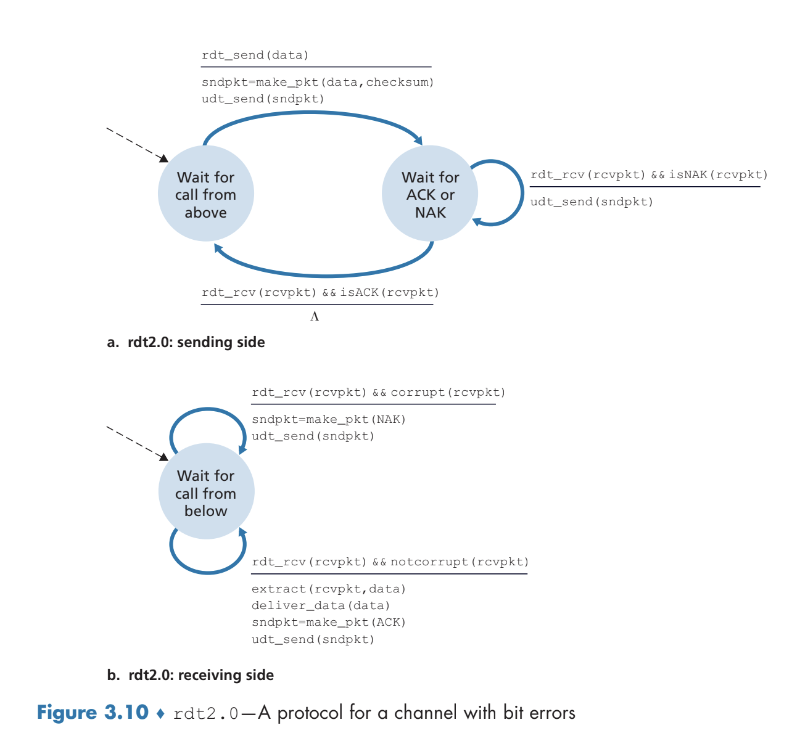
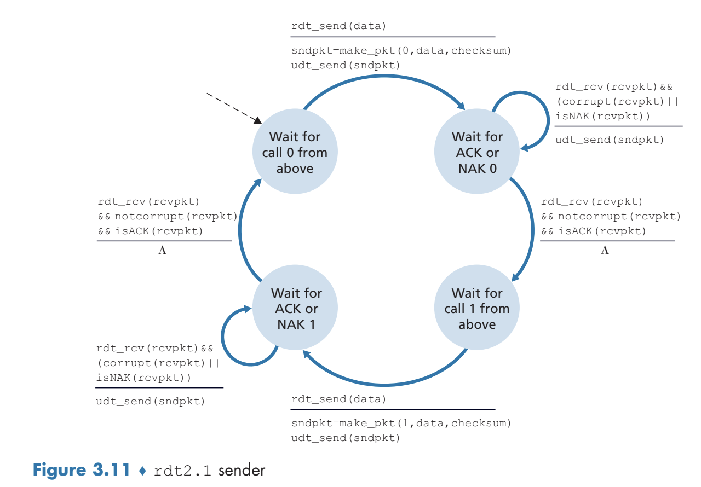
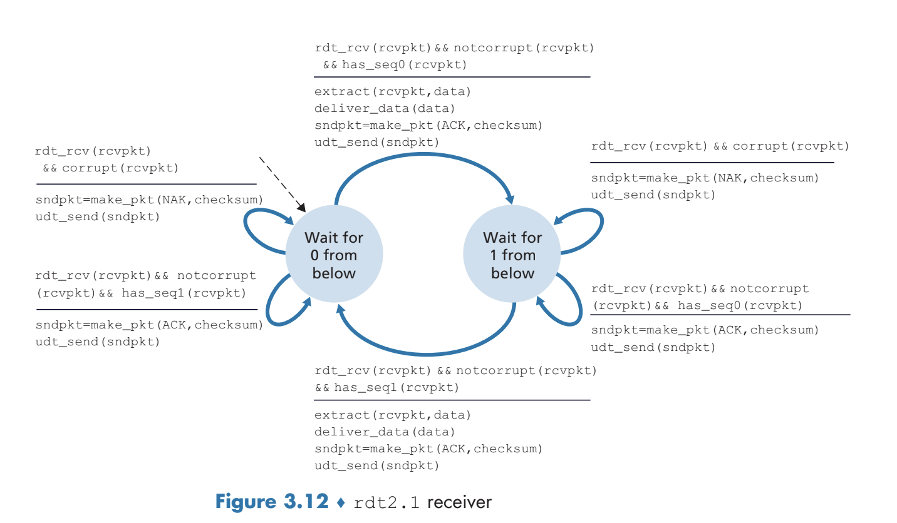
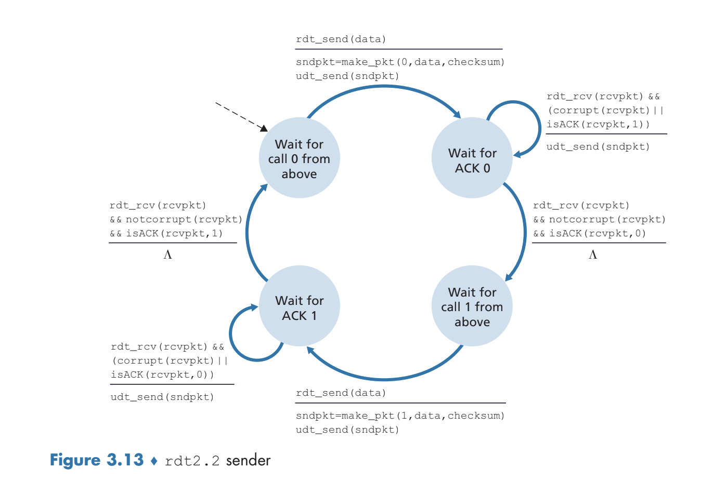
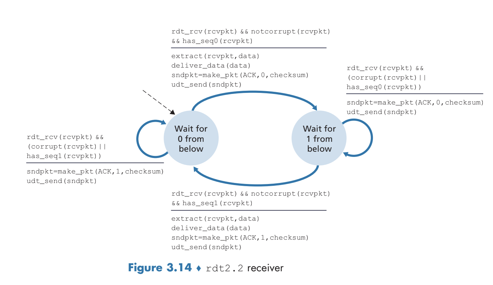
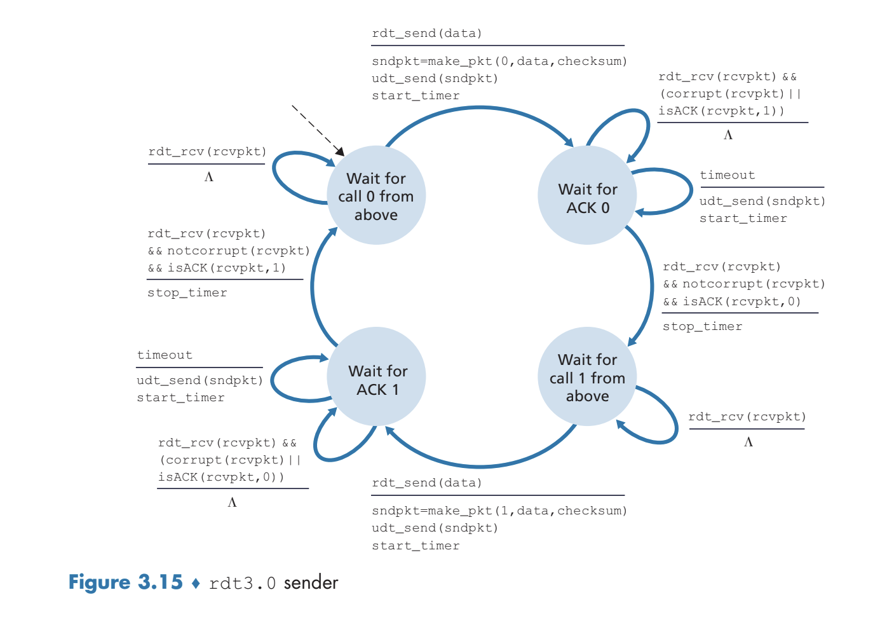
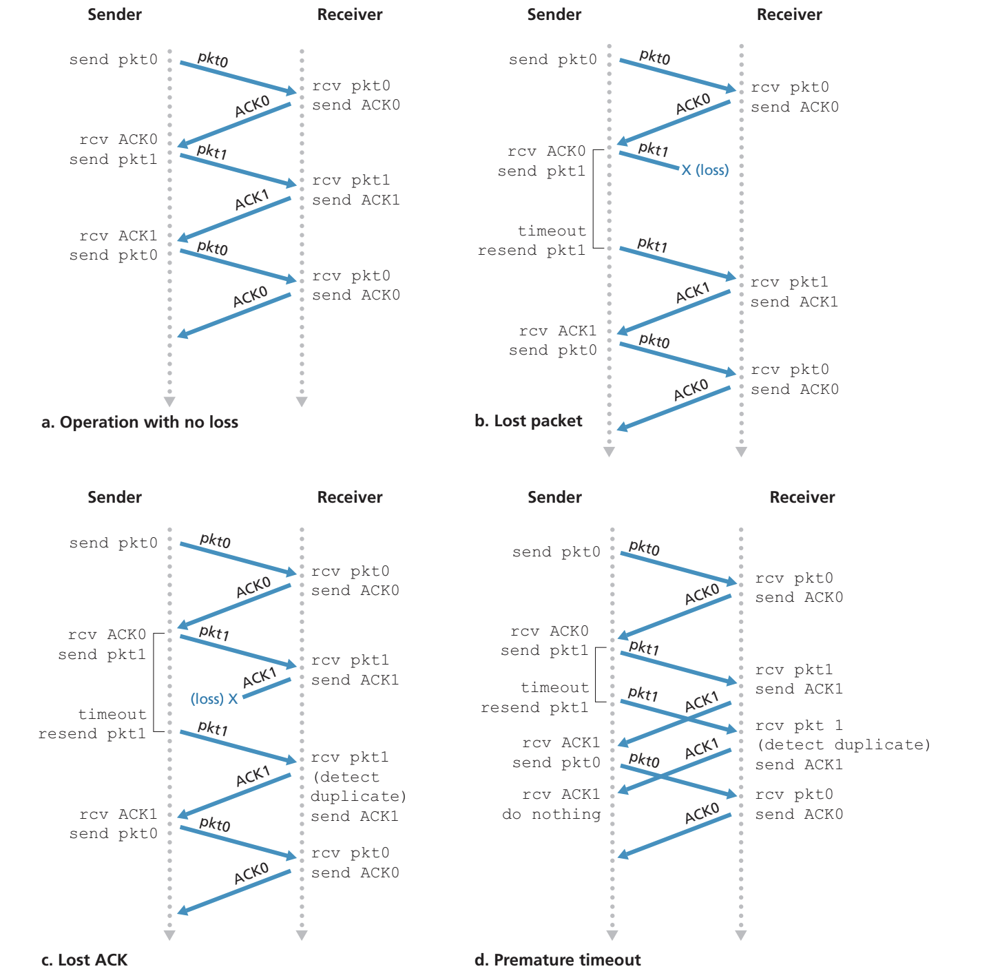
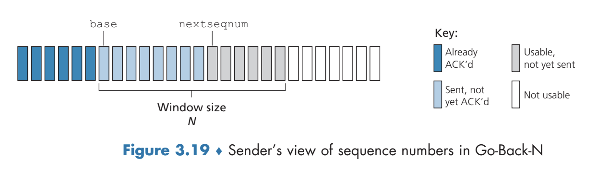

# Transport Layer
## Introduction and Transport-Layer Services
- The transport layer allows for **logical communication** between application processes running on different hosts - from the application's perspective, it appears as if the hosts are directly connected
- The transport layer is implemented in *end systems*, converting application-layer messages into transport-layer **segments**
	- The application-layer message is broken down into smaller chunks and a transport-layer header is added to these chunks to form the segments
- Transport-layer segments are passed into the network layer from the sending end system, where it becomes encapsulated into a network layer datagram and is sent to the destination
### Relationship Between Transport and Network Layers
- The transport layer provides communication between *processes* running on different hosts whereas the network layer provides communication between the *hosts*
- The network layer does not act on the information the transport layer may have added (to the application layer message) - there is encapsulation
- The transport layer is inherently constrained by the network layer - if the network layer cannot provide any guarantees regarding bandwidth or delay, then the transport layer cannot provide any such guarantees either
- The Internet's network layer focuses on a **best-effort delivery service**, meaning there is no *guarantee* about the delivery, ordering, or integrity of data - it is **unreliable**
### Overview of the Transport Layer in the Internet
- The **User Datagram Protocol (UDP)** provides an *unreliable, connectionless* service whereas the **Transmission Control Protocol (TCP)** provides a *reliable, connection-oriented* service
- Both UDP and TCP extend the network layer's Internet protocol from *hosts* to *processes* via **transport-layer multiplexing** and **demultiplexing**
- TCP specifically provides **reliable data transfer** via flow control, sequence numbers, acknowledgement, and timers to ensure data is delivered correctly and in order
	- TCP also provides **congestion control**, which acts more as a service for the Internet in general, since it prevents any one TCP connection from hogging links with an excessive amount of traffic
## Multiplexing and Demultiplexing
- When the transport layer of a device receives data from the network layer, it must *direct* this received data to the appropriate process - this is because *multiple processes* may be using the Internet via higher application (layer) processes
	- The transport layer does this by directing a message to the appropriate *socket* - this is **demultiplexing**
	- **Multiplexing** involves gathering data from the source host's different sockets, encapsulating each data chunk with header information (that can be used to later demultiplex), and then passing it through the network layer
- In the context of UDP, all that is necessary to multiplex is a **source port number field** and a **destination port number field** in the header of the transport-layer message
	- When a segment arrives at a host, the transport layer examines the destination port number and directs it to the corresponding socket
	- When a process sends data via UDP, the transport layer, in addition to the data, includes a header field containing the source port number and destination port number (and some other fields) before passing it down to the network layer
		- Including the source port number allows the receiver to know what port to send data *back* to
	- Two differently sourced segments (IP address and/or port number) will go into the *same* destination socket if they specify the same destination IP address and destination port number
	- It is typically the case that a server is manually assigned a port number (usually a **well-known port number**, such as `80` for HTTP servers) whereas a client is automatically assigned a port number via the transport layer
- In the context of TCP, which is a connection-oriented (via an initial handshake) protocol, multiplexing involves using `(Source IP, Source Port, Destination IP, Destination Port)` to identify the appropriate socket to pass a message in to
	- There is an initial connection-establishment socket, which, upon accepting a connection, results in the creation of a new socket based on the source port number, the IP address of the source, the destination port number, and the IP address of the destination
	- This implies that differently sourced segments with the *same destination IP address and port* will not necessarily go to the same socket, since sockets are based on the source IP address and port
	- 
## Connectionless Transport: UDP
- UDP is based on being lightweight, and so it only provides bare minimum functionality: multiplexing/demultiplexing and check summing
- Many application-layer protocols (e.g. DNS) may leverage UDP for a variety of reasons:
	- UDP provides more control over what data is sent and when, unlike TCP which may throttle the transport layer via congestion control
		- Thus, real-time applications that may not allow delay and can serve to tolerate some data loss would prefer UDP over TCP
	- UDP does not require an initial connection establishment (handshaking), thus minimizing delay
	- UDP does not require connection state, unlike TCP which must maintain buffers, congestion control parameters, and sequence and acknowledgement parameters for its connections
	- UDP has a smaller packet header overhead
- Although UDP itself does not guarantee reliable data transfer, applications running UDP can still make such a guarantee by ensuring reliability at the *application-layer*, although this incurs more complexity in creating the application
- UDP performs its check summing by taking the sum of all 16-bit words in the segment and then taking the 1's complement (XOR) of the result - this checksum is passed into the header of the message
	- The receiver takes the sum of all 16-bit words *and* the checksum - if the result is not all 1's, then there was an error
	- Checksums are necessary at the transport level because although many link-layer protocols provide error checking, there is no guarantee that *all* link-layer protocols do so
		- This is an example of the **end-to-end** argument in system design, as error-detecting at lower levels is redundant or of less value compared to error-detecting at higher levels
	- Although UDP *checks* for errors, it does not *recover* errors - TCP does so instead
- 
## Principles of Reliable Data Transfer
- In a **reliable data transfer protocol**, no transferred data bits are corrupted or lost and are delivered *in the order sent*
	- This can be inherently difficult to implement because the layer *below* reliable data transfer protocol may be unreliable
### rdt2.0: Data Transfer over a Channel with Bit Errors
- Assuming, for now, that all packets are *received* but may be *corrupted*, the issue of bit errors can be addressed via **positive acknowledgements (ACK)** and **negative acknowledgements (NAK)**, whereas the former is returned by the receiver to indicate that a packet has been received properly whereas the latter is returned by the receiver to indicate that the packet should be retransmitted
	- Reliable data transfer protocols based on retransmission are known as **Automatic Repeat reQuest (ARQ) protocols**
- Packet corruption can be detected via checksums or other similar techniques - regardless of the technique, this involves additional bits on the packet
- 
	- This is a **stop-and-wait** protocol, as the sender *cannot* get more data from the upper layer to send until it receives an acknowledgement
	- This protocol has a flaw in that it does not account for the case in which the `ACK` or `NAK` control packets themselves become corrupted
- To account for the `ACK` or `NAK` packets being corrupted, it is necessary to include a checksum for such packets *and*, upon the sender receiving a corrupted `ACK` or `NAK` response, to resend the current data packet
	- If the packet is *resent*, however, the receiver may not know whether the packet is a new packet or just a retransmission, so it is also necessary to have a **sequence number** field for the data packets as to check whether a received packet is a retransmission or not
		- For a stop-and-wait protocol, only a 1 bit sequence number is necessary, as the bit can be used to *alternate* sequences
- 
	- 
	- The sender will retransmit on corruption (either via the data or the control packets) or on an explicit `NAK`, and will alternate between sending a `0` and `1` state to ensure there is in ambiguity on retransmissions
	- Likewise, the receiver will check to make sure the sequence number matches and that the data itself is not corrupt (and otherwise send a `NAK`) , also alternating between the sequence number states 
- Alternatively, instead of sending a `NAK`, instead an `ACK` could be sent for the last received packet - so a two `ACK`'s for the same packet (based on the sequence number) acts as a `NAK` and therefore simplifies in the state machine
	- 
	- 
### rdt3.0 Data Transfer over a Channel with Packet Loss
- Packet loss can be detected via a **timer** on the sender-side, and upon a **timeout**, the packet can be retransmitted by the sender
	- The sender starts a timer each time a packet is sent and if an `ACK` is received before a timeout, the timer can be stopped - otherwise, it is assumed that the packet was lost and thus it is resent
		- It may not necessarily be the case that the packet is lost on a timeout - it could just take a long time to be sent or it could even be possible that the packet was sent properly but the return `ACK` was lost (or took too long)
- 
- 
### Pipelined Data Transfer Protocols
- Using an **stop-and-wait protocol** is inherently slow given that the sender must wait for the current packet to send and then receive an `ACK` before sending the next packet
	- This has very poor **utilization** of the sender's channel: $U_{sender} = \frac{L/R}{RTT + L/R}$
- A better approach is one that is **pipelined**, allowing for many packets to be sent at once
#### Go-Back-N (GBN) Protocol
- In the **Go-Back-N protocol**, the sender can send multiple packets without waiting for acknowledgement, but is limited to having no more than $N$ unacknowledged packets in the pipeline
	- This can be viewed as a **sliding-window protocol**
		- 
- FSM:
	- 
	- 
- An acknowledgement in GBN is viewed as a **cumulative acknowledgement**, which means that it indicates all packets *up to and including n* have been correctly received
	- On a timeout event, all packets that have been *previously sent but not acknowledged* (`base` to `nextseqnum - 1`) are resent
	- There is only a single timer, acting as a timer for `base`
- The receiver will acknowledge correctly delivered, in-order packets with the corresponding sequence number
	- For incorrect or out-of-order packets, the receiver will acknowledge the most recently delivered in-order 
	- The out-of-order packets are discarded, since they will be resent later on anyways by the sender on a timeout event - there is no need for the receiver to buffer the out-of-order packets as a result
- 
