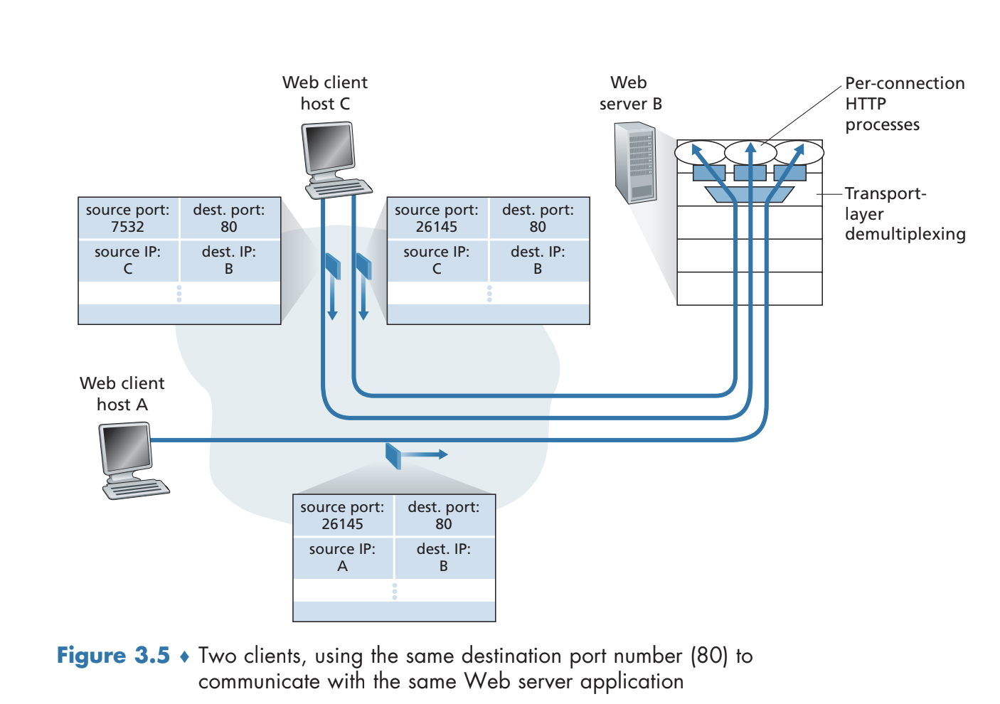
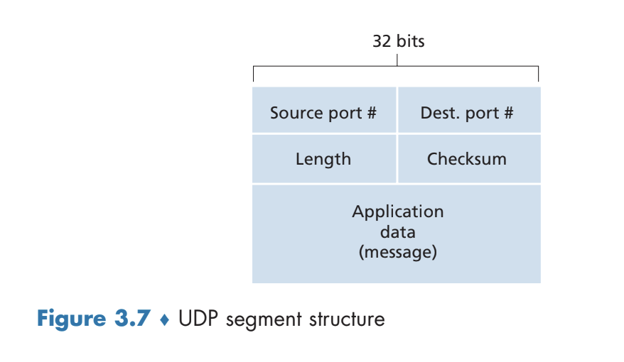
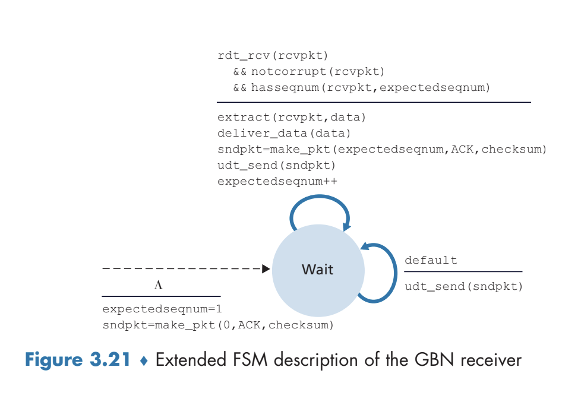
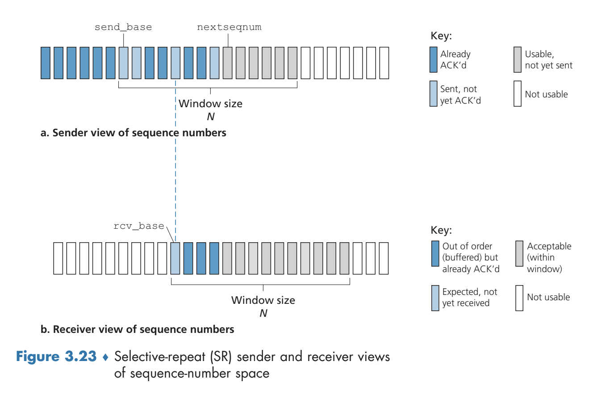
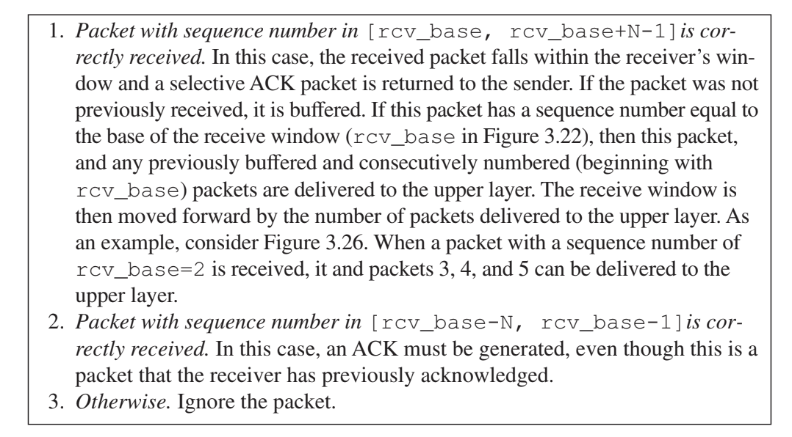
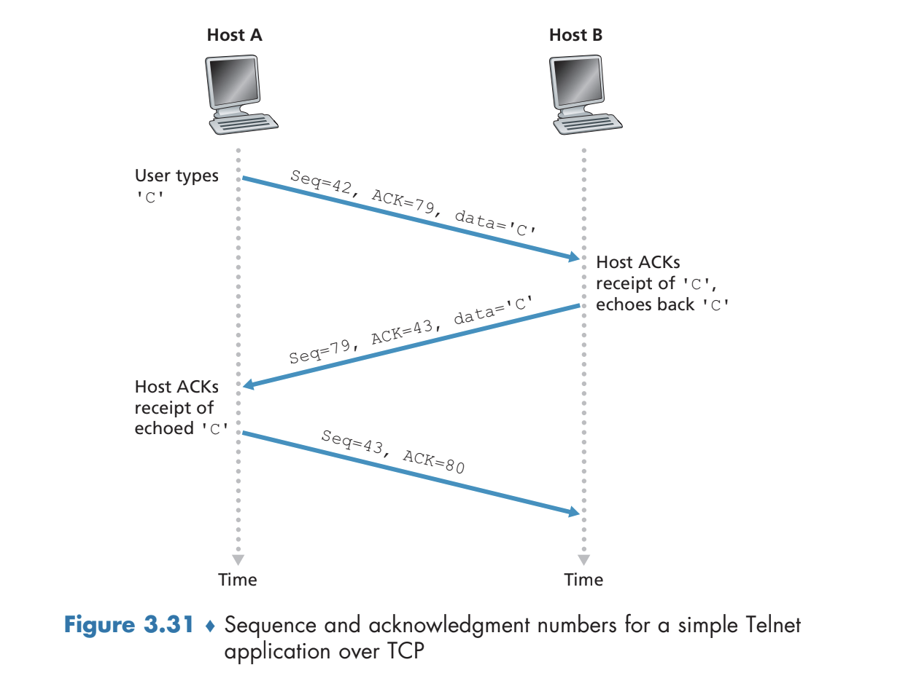
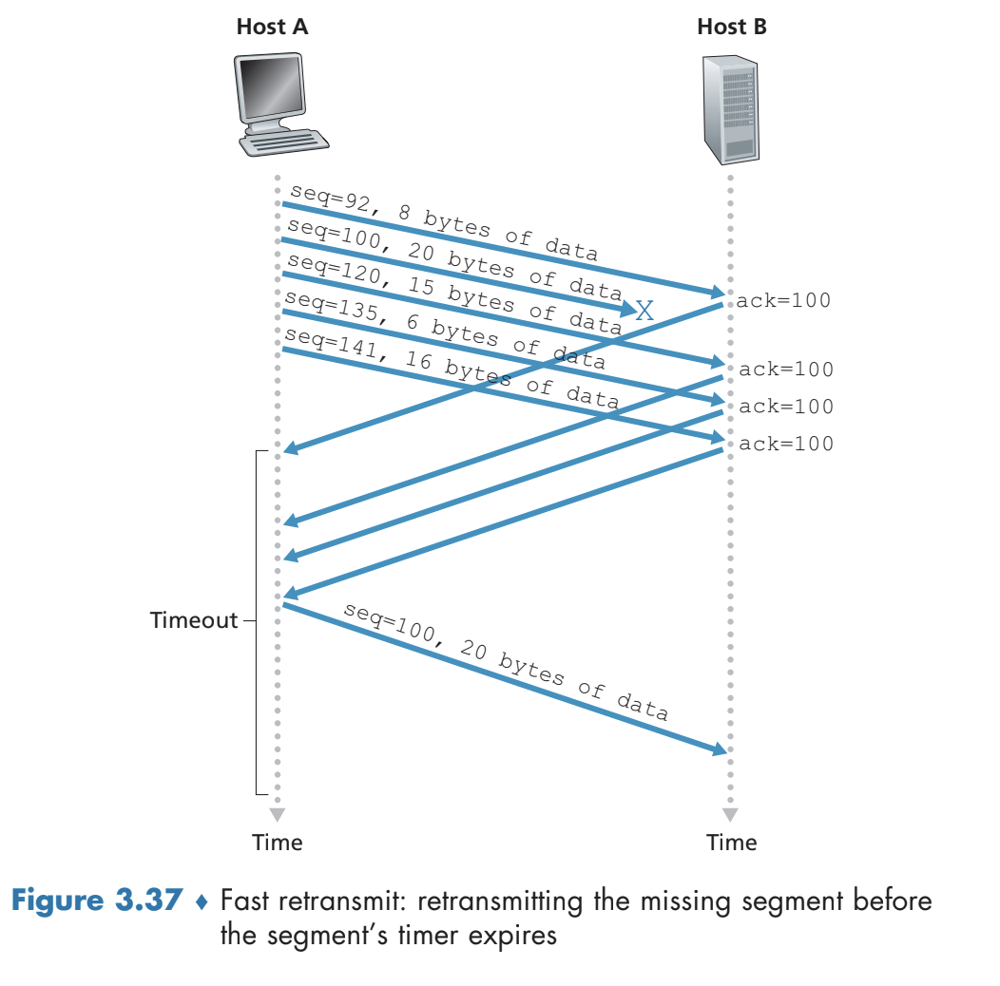

# Transport Layer
## Introduction and Transport-Layer Services
- The transport layer allows for **logical communication** between application processes running on different hosts - from the application's perspective, it appears as if the hosts are directly connected
- The transport layer is implemented in *end systems*, converting application-layer messages into transport-layer **segments**
	- The application-layer message is broken down into smaller chunks and a transport-layer header is added to these chunks to form the segments
- Transport-layer segments are passed into the network layer from the sending end system, where it becomes encapsulated into a network layer datagram and is sent to the destination
### Relationship Between Transport and Network Layers
- The transport layer provides communication between *processes* running on different hosts whereas the network layer provides communication between the *hosts*
- The network layer does not act on the information the transport layer may have added (to the application layer message) - there is encapsulation
- The transport layer is inherently constrained by the network layer - if the network layer cannot provide any guarantees regarding bandwidth or delay, then the transport layer cannot provide any such guarantees either
- The Internet's network layer focuses on a **best-effort delivery service**, meaning there is no *guarantee* about the delivery, ordering, or integrity of data - it is **unreliable**
### Overview of the Transport Layer in the Internet
- The **User Datagram Protocol (UDP)** provides an *unreliable, connectionless* service whereas the **Transmission Control Protocol (TCP)** provides a *reliable, connection-oriented* service
- Both UDP and TCP extend the network layer's Internet protocol from *hosts* to *processes* via **transport-layer multiplexing** and **demultiplexing**
- TCP specifically provides **reliable data transfer** via flow control, sequence numbers, acknowledgement, and timers to ensure data is delivered correctly and in order
	- TCP also provides **congestion control**, which acts more as a service for the Internet in general, since it prevents any one TCP connection from hogging links with an excessive amount of traffic
## Multiplexing and Demultiplexing
- When the transport layer of a device receives data from the network layer, it must *direct* this received data to the appropriate process - this is because *multiple processes* may be using the Internet via higher application (layer) processes
	- The transport layer does this by directing a message to the appropriate *socket* - this is **demultiplexing**
	- **Multiplexing** involves gathering data from the source host's different sockets, encapsulating each data chunk with header information (that can be used to later demultiplex), and then passing it through the network layer
- In the context of UDP, all that is necessary to multiplex is a **source port number field** and a **destination port number field** in the header of the transport-layer message
	- When a segment arrives at a host, the transport layer examines the destination port number and directs it to the corresponding socket
	- When a process sends data via UDP, the transport layer, in addition to the data, includes a header field containing the source port number and destination port number (and some other fields) before passing it down to the network layer
		- Including the source port number allows the receiver to know what port to send data *back* to
	- Two differently sourced segments (IP address and/or port number) will go into the *same* destination socket if they specify the same destination IP address and destination port number
	- It is typically the case that a server is manually assigned a port number (usually a **well-known port number**, such as `80` for HTTP servers) whereas a client is automatically assigned a port number via the transport layer
- In the context of TCP, which is a connection-oriented (via an initial handshake) protocol, multiplexing involves using `(Source IP, Source Port, Destination IP, Destination Port)` to identify the appropriate socket to pass a message in to
	- There is an initial connection-establishment socket, which, upon accepting a connection, results in the creation of a new socket based on the source port number, the IP address of the source, the destination port number, and the IP address of the destination
	- This implies that differently sourced segments with the *same destination IP address and port* will not necessarily go to the same socket, since sockets are based on the source IP address and port
	- 
## Connectionless Transport: UDP
- UDP is based on being lightweight, and so it only provides bare minimum functionality: multiplexing/demultiplexing and check summing
- Many application-layer protocols (e.g. DNS) may leverage UDP for a variety of reasons:
	- UDP provides more control over what data is sent and when, unlike TCP which may throttle the transport layer via congestion control
		- Thus, real-time applications that may not allow delay and can serve to tolerate some data loss would prefer UDP over TCP
	- UDP does not require an initial connection establishment (handshaking), thus minimizing delay
	- UDP does not require connection state, unlike TCP which must maintain buffers, congestion control parameters, and sequence and acknowledgement parameters for its connections
	- UDP has a smaller packet header overhead
- Although UDP itself does not guarantee reliable data transfer, applications running UDP can still make such a guarantee by ensuring reliability at the *application-layer*, although this incurs more complexity in creating the application
- UDP performs its check summing by taking the sum of all 16-bit words in the segment and then taking the 1's complement (XOR) of the result - this checksum is passed into the header of the message
	- The receiver takes the sum of all 16-bit words *and* the checksum - if the result is not all 1's, then there was an error
	- Checksums are necessary at the transport level because although many link-layer protocols provide error checking, there is no guarantee that *all* link-layer protocols do so
		- This is an example of the **end-to-end** argument in system design, as error-detecting at lower levels is redundant or of less value compared to error-detecting at higher levels
	- Although UDP *checks* for errors, it does not *recover* errors - TCP does so instead
- 
## Principles of Reliable Data Transfer
- In a **reliable data transfer protocol**, no transferred data bits are corrupted or lost and are delivered *in the order sent*
	- This can be inherently difficult to implement because the layer *below* reliable data transfer protocol may be unreliable
### rdt2.0: Data Transfer over a Channel with Bit Errors
- Assuming, for now, that all packets are *received* but may be *corrupted*, the issue of bit errors can be addressed via **positive acknowledgements (ACK)** and **negative acknowledgements (NAK)**, whereas the former is returned by the receiver to indicate that a packet has been received properly whereas the latter is returned by the receiver to indicate that the packet should be retransmitted
	- Reliable data transfer protocols based on retransmission are known as **Automatic Repeat reQuest (ARQ) protocols**
- Packet corruption can be detected via checksums or other similar techniques - regardless of the technique, this involves additional bits on the packet
- 
	- This is a **stop-and-wait** protocol, as the sender *cannot* get more data from the upper layer to send until it receives an acknowledgement
	- This protocol has a flaw in that it does not account for the case in which the `ACK` or `NAK` control packets themselves become corrupted
- To account for the `ACK` or `NAK` packets being corrupted, it is necessary to include a checksum for such packets *and*, upon the sender receiving a corrupted `ACK` or `NAK` response, to resend the current data packet
	- If the packet is *resent*, however, the receiver may not know whether the packet is a new packet or just a retransmission, so it is also necessary to have a **sequence number** field for the data packets as to check whether a received packet is a retransmission or not
		- For a stop-and-wait protocol, only a 1 bit sequence number is necessary, as the bit can be used to *alternate* sequences
- 
	- 
	- The sender will retransmit on corruption (either via the data or the control packets) or on an explicit `NAK`, and will alternate between sending a `0` and `1` state to ensure there is in ambiguity on retransmissions
	- Likewise, the receiver will check to make sure the sequence number matches and that the data itself is not corrupt (and otherwise send a `NAK`) , also alternating between the sequence number states 
- Alternatively, instead of sending a `NAK`, instead an `ACK` could be sent for the last received packet - so a two `ACK`'s for the same packet (based on the sequence number) acts as a `NAK` and therefore simplifies in the state machine
	- 
	- 
### rdt3.0 Data Transfer over a Channel with Packet Loss
- Packet loss can be detected via a **timer** on the sender-side, and upon a **timeout**, the packet can be retransmitted by the sender
	- The sender starts a timer each time a packet is sent and if an `ACK` is received before a timeout, the timer can be stopped - otherwise, it is assumed that the packet was lost and thus it is resent
		- It may not necessarily be the case that the packet is lost on a timeout - it could just take a long time to be sent or it could even be possible that the packet was sent properly but the return `ACK` was lost (or took too long)
- 
- 
### Pipelined Data Transfer Protocols
- Using an **stop-and-wait protocol** is inherently slow given that the sender must wait for the current packet to send and then receive an `ACK` before sending the next packet
	- This has very poor **utilization** of the sender's channel: $U_{sender} = \frac{L/R}{RTT + L/R}$
- A better approach is one that is **pipelined**, allowing for many packets to be sent at once
#### Go-Back-N (GBN) Protocol
- In the **Go-Back-N protocol**, the sender can send multiple packets without waiting for acknowledgement, but is limited to having no more than $N$ unacknowledged packets in the pipeline
	- This can be viewed as a **sliding-window protocol**
		- 
- FSM:
	- 
	- 
- An acknowledgement in GBN is viewed as a **cumulative acknowledgement**, which means that it indicates all packets *up to and including n* have been correctly received
	- On a timeout event, all packets that have been *previously sent but not acknowledged* (`base` to `nextseqnum - 1`) are resent
	- There is only a single timer, acting as a timer for `base`
- The receiver will acknowledge correctly delivered, in-order packets with the corresponding sequence number
	- For incorrect or out-of-order packets, the receiver will acknowledge the most recently delivered in-order 
	- The out-of-order packets are discarded, since they will be resent later on anyways by the sender on a timeout event - there is no need for the receiver to buffer the out-of-order packets as a result
- 
#### Selective Repeat (SR)
- The GBN protocol can retransmit a large amount of packets, which can fill a connection pipeline with unnecessary retransmissions
- The **selective repeat (SR) protocol** only retransmits packets that are suspected of being in error
	- Doing so requires the receiver acknowledging *each packet individually*
- This protocol still maintains a window of size *N* to limit the number of unacknowledged packets
	- 
- The receiver acknowledges a correctly received packet regardless of its order, and takes to ensure that out-of-order packets are buffered
	- Once lower sequence number packets arrive to fill the gap in packet ordering, these packets can be sent in a batch to the upper layer
- Protocol:
	- 
	- 
		- The receiver should still reacknowledge already received packets with sequence numbers below the current window because otherwise the sender would not be able to move its window forward
- In general, transfer protocols - whether it be GBN or SR - assume that packets are not reordered within the channel between the sender and receiver - but this can actually be the case with network channels
	- A network can be thought of as buffering a packet and then spontaneously emitting them in the future
	- To guard against these duplicate packets, especially since sequence numbers used in protocols are finite (so they are reused, and a duplicate packet with the same sequence number as a new data packet arriving first can cause the new data packet to never be truly acknowledged), packets are typically given a *time-to-live* field
		- A typical time to live field is *three minutes*
## Connection-Oriented Transport: TCP
- TCP is a **connection-oriented** protocol, implying that it requires the *end systems* to maintain state variables associated with the connection
	- Only the *end systems* maintain the connection state - the intermediate routers are unaware of TCP
- A TCP connection is initially established via a **three-way handshake**
	- After this handshake, a server application passes the data that it will send to the TCP **send buffer**, which directs segments to the **receive buffer** on the client side, and this receive buffer eventually passes the data upwards to the client application
	- The maximum amount of data that can be placed in a segment (taken from the send buffer) is limited by the **maximum segment size (MSS)**, which is determined by the length of the largest link-layer frame that can be sent by the sender - this is the **maximum transmission unit (MTU)**
		- From the MTU, the MSS is set such that a TCP segment plus the TCP/IP header will fit in this frame
### TCP Segment Structure
- Large files are typically broken up into chunks of size MSS
- 
	- The 32-bit **sequence number field** and the 32-bit **acknowledgement number field** are used to ensure reliable data transfer
	- The 16-bit **receive window field** is used for flow control
	- The 4-bit **header length field** specifies the length of the TCP header in 32-bit words, as the header length can vary due to the options field
	- The **options field**, which is optional and variable-length, is used for purposes such as negotiate a MSS 
	- The **flag field** contains 6 bits
		- The **ACK bit** indicates that the value carried in the acknowledgement field is valid (there is an actual acknowledgement)
		- The **RST**, **SYN**, and **FIN** bits are used for TCP connection setup and closing
		- The **CWR** and **ECE** bits are used for congestion notification
		- The **PSH** bit indicates that the receiver should pass the data to the upper layer immediately
		- The **URG** bit indicates that there is data that the sending-side has marked as urgent
			- The location of this urgent data is indicated by the 16-bit **urgent data pointer field**
#### Sequence Numbers and Acknowledgement Numbers
- TCP views data as an unstructured, ordered sequence of bytes
	- With this in mind, sequence numbers are *not* in terms of segments but rather in terms of *bytes* in the underlying data stream
	- The **sequence number** for a segment is the *byte-stream* number of the first byte in that segment
		- Example: For a MSS of 1000 bytes, the first segment of a (large) file will have sequence number 0, the next one will have sequence number 1000, then 2000, and so forth
	- These sequence numbers are inserted in the sequence number field of the TCP header
- The **acknowledgement number** is the sequence number of the *next byte* that a receiver expects from a sender
	- Example: If a client has received bytes 0 to 535, its acknowledgement number to the server will be 536, because it expects a segment starting with byte 536
	- TCP utilizes **cumulative acknowledgements**, so only bytes up to the first missing byte in the stream is acknowledged
		- Example: If a client has received bytes 0 to 535 *and* bytes 900 to 1000, it will only acknowledge the first segment by returning an acknowledgement number of 536. 
	- If out-of-order segments are received, it is up to the implementation to decide what to do with them - in practice, the receiver keeps the out-of-order segments and usually waits for a short amount of time for the missing "gaps" to arrive
- The initial sequence numbers are typically initialized to *random values* to minimize any possible errors arising from an already-existing segment in the network with the same sequence number 
- Since TCP is a **fully duplex connection**, meaning that a hosts can send data both ways, the client and servers will have their *own* starting sequence numbers
	- With this in mind, it is common for acknowledgements to be **piggy-backed** on actual data segments (rather than just sending an acknowledgement alone) for two-way communications
	- 
### Round-Trip Estimation Time and Timeout
- Timeout mechanisms are used for the purpose of segment transmissions, but this requires determining the *length* of this timeout interval
	- This requires estimating the RTT of the connection
- The `SampleRTT` for a segment is the amount of time between when the segment is sent and when the segment is acknowledged
	- Most TCP implementations take only one `SampleRTT` measurement at a time, which results in a new value of `SampleRTT` approximately once every RTT
- The `EstimatedRTT` is calculated via an **exponential weighted moving average**
	- $EstimatedRTT=(1-\alpha)(EstimatedRTT) + \alpha(SampleRTT)$
		- Typically $\alpha$ is set to be 0.125
	- This weighted average puts more emphasis on *recent samples* than old samples, but still ensures stability via an average
- The variability of the RTT is measured as:
	- $DevRTT = (1-\beta)DevRTT + \beta|SampleRTT - EstimatedRTT|$
- With these values, the timeout interval is set to be:
	- `TimeoutInterval = EstimatedRTT + 4 * DevRTT`
	- The initial timeout recommended to be set to 1 seconds
	- On a timeout, the timeout is set to be *double* the previous timeout to avoid a premature timeout
		- In the cases where there is no timeout, the timeout interval is set according to the aforementioned calculation
### Reliable Data Transfer
- In practice, TCP maintains only a *single timer*, as it  avoids the overhead associated with multiple timer interrupts
- Pseudocode:
	-     NextSeqNumber=InitialSeqNumber
		  SendBase=InitialSeqNumber
		  loop (forever) {
			  switch(event)
				  event: data received from application above
					  create TCP segment with sequence number NextSeqNum
					  if (timer currently not running)
						  start timer
					  pass segment to IP
					  NextSeqNum+=NextSeqNum+length(data)
					  break;
				  event: timer timeout
					  retransmit not-yet-acknowledged segment with smallest sequence number
					  start timer
					  break;
				  event: ACK is received, with ACK field value of y
					  if (y > SendBase) {
						  SendBase=y
						   if (there are currently any not yet acknowledged segments)
							   start timer
					  }
					  else {
						  increment the number of duplicate ACKs received for y
						  if (number of duplicated ACKs received for y == 3)
							  // Fast retransmit
							  resend segment with sequence number y
					  }	  
		  }
 - If a segment is lost and the timeout period is relatively long, there may be increased delay if no measures are taken	
	 - A sender can often detect packet loss before a timeout occurs by noting **duplicate ACKs**
	 - If an out-of-order segment arrives, the receiver will acknowledge the last *in-order* byte of data received (not the out-of-order segment) - this is a duplicate ACK
		 - If a segment is lost, then the subsequent segments will arrive but the acknowledgements will only be for the lost segment (relative to the ordering), so the duplicate ACK will be returned many times
	 - On three duplicate ACKs, a **fast retransmit** occurs, since it is assumed that the segment is lost - this retransmits *without* needing to wait for the timer
	 - 
### Flow Control
- The receiving side will place data that is correct and in-order in the receive buffer, but the application may not necessarily read from this buffer immediately
	- Since the buffer is fixed length, it may be overwhelmed if too much data is sent while there is not enough time to read it all, hence why **flow control** is necessary
- The *sender* maintains a variable known as the **receive window**, giving them an idea of how much free space is available for the receiver
- The *receiver* calculates `rwnd` and includes it in the window field of the TCP segment to be sent to the  *sender*
	- `rwnd = RcvBuffer - [LastByteRcvd - LastByteRead]`
- The sender keeps track of `LastByteSent` and `LastByteAcked` and ensures that `LastByteSent - LastByteAcked <= rwnd`
	- If `rwnd` is 0, at least one byte should still be sent as otherwise the messages will *stall* (the receiver has cleared up space in its buffer, but since the sender is not sending any more bits the receiver can no longer communicate the new `rwnd` without any incoming messages first)
### TCP Connection Management
- On establishing a connection:
	- The client sends a special TCP segment to the server, with this segment having the `SYN` bit set to 1 and containing an initial sequence number (randomized) in the sequence number field
	- Once the SYN segment arrives, the server allocates the proper buffers and variables associated with the connection and returns a segment with the `SYN` bit set to 1, the acknowledgement field set to the client's initial sequence number plus 1, and the sequence number field set to the *server's* initial sequence number (randomized)
	- Once the client receives the SYNACK segment, it allocates its own buffers and variables and finally sends an acknowledgement segment to the server, with acknowledgment number being the server's initial sequence number plus 1
- On ending a connection:
	- The client sends a message with the `FIN` bit set to 1
	- The server sends an acknowledgement to the aforementioned segment
	- The server then sends its own shutdown segment, with the `FIN` bit also set to 1
	- The client acknowledges this
