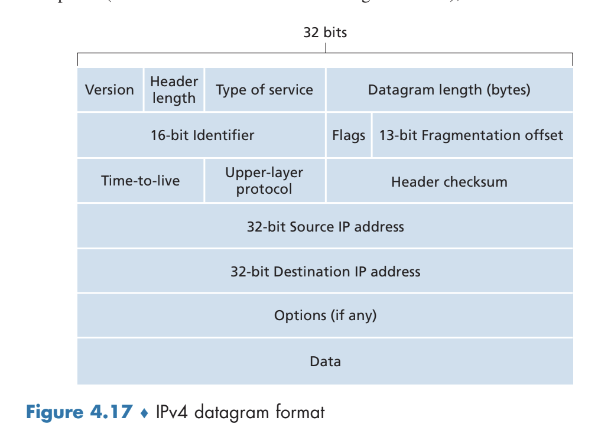
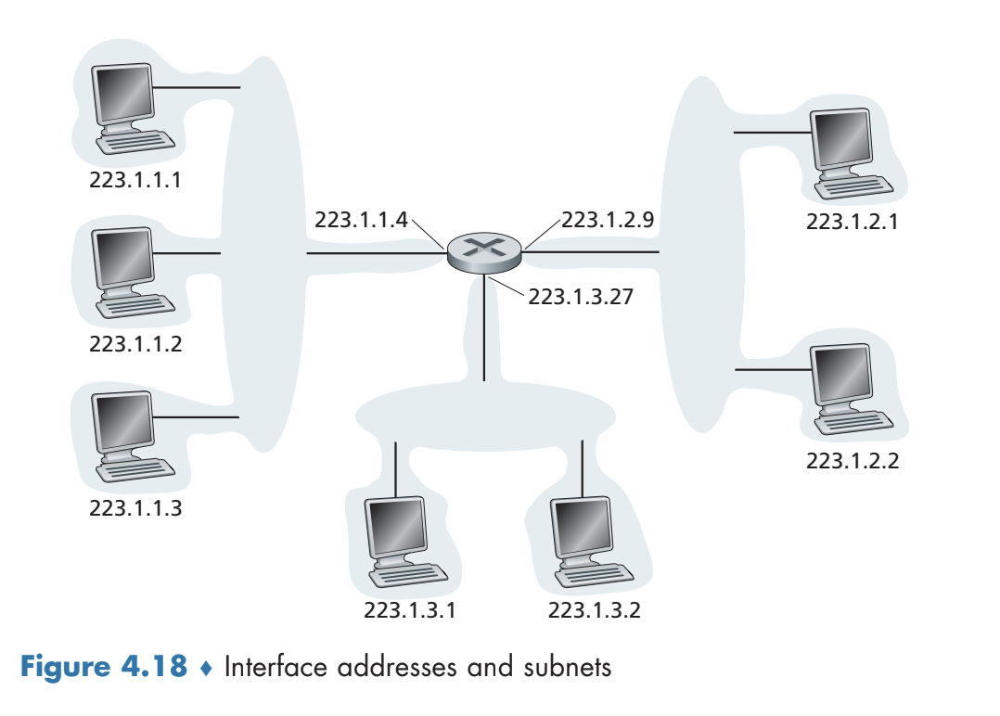
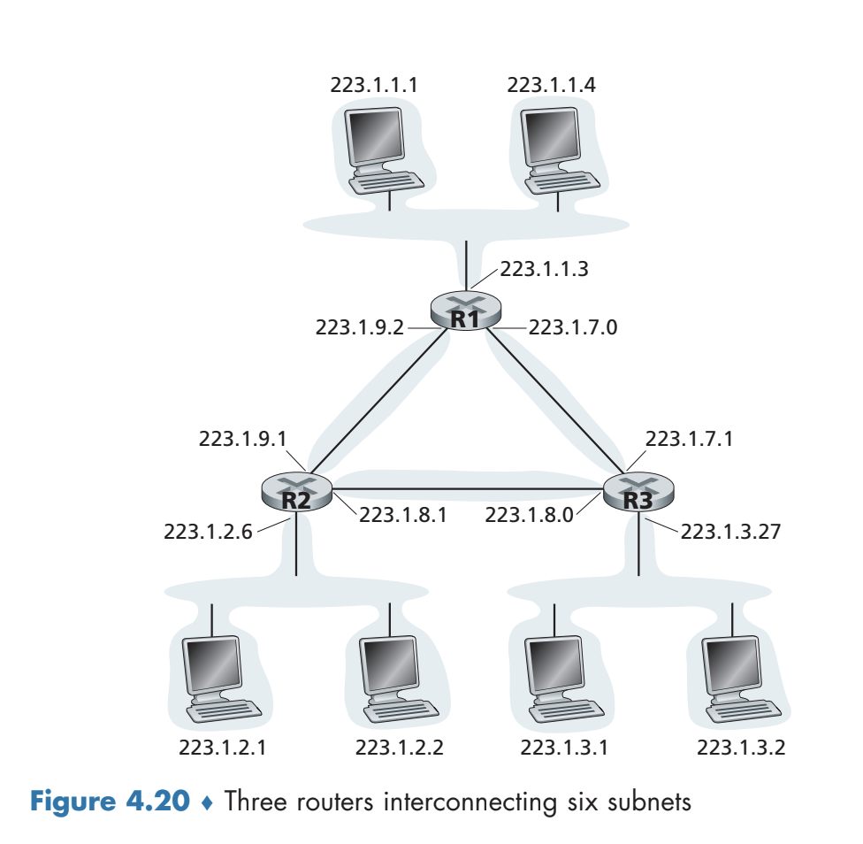
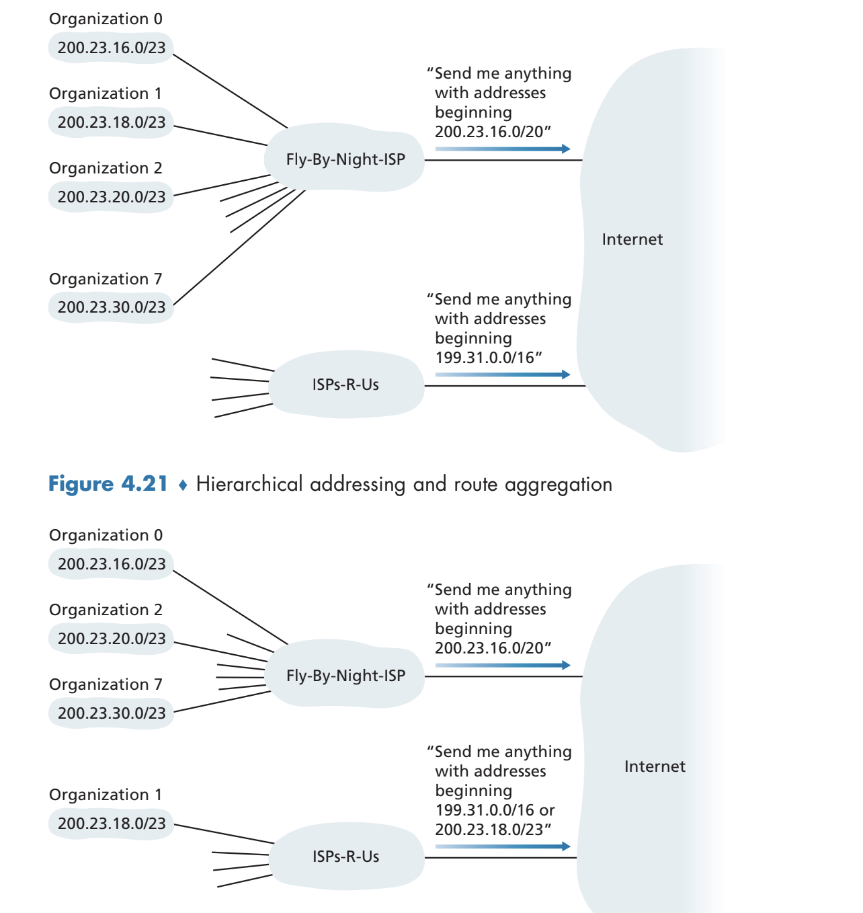
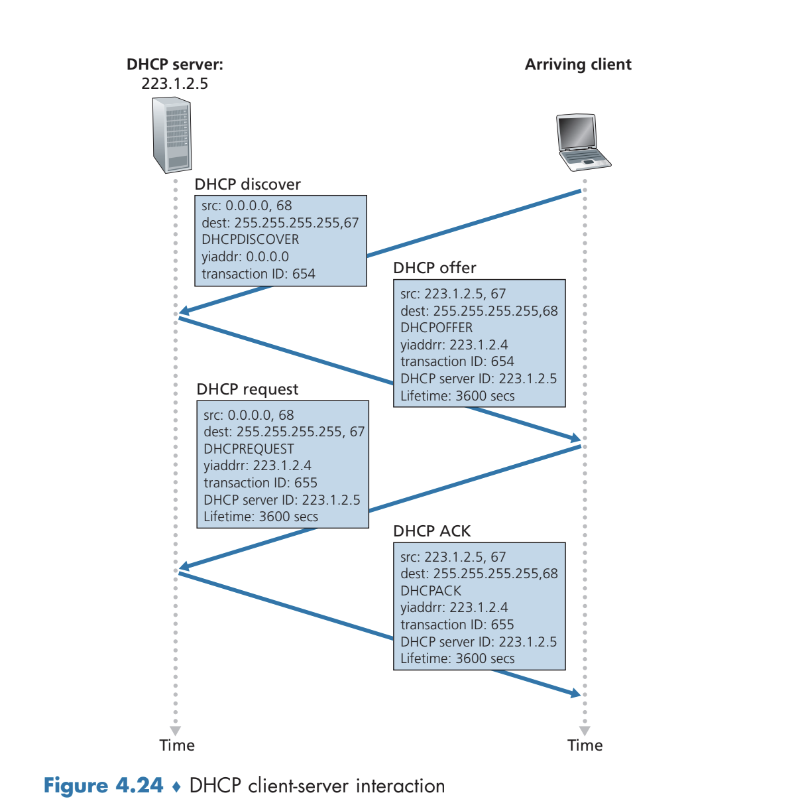
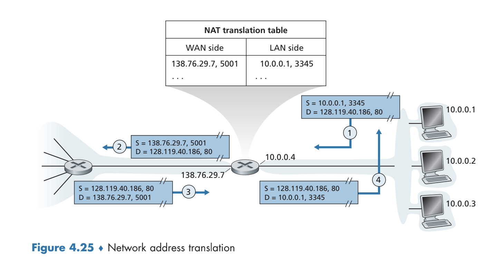
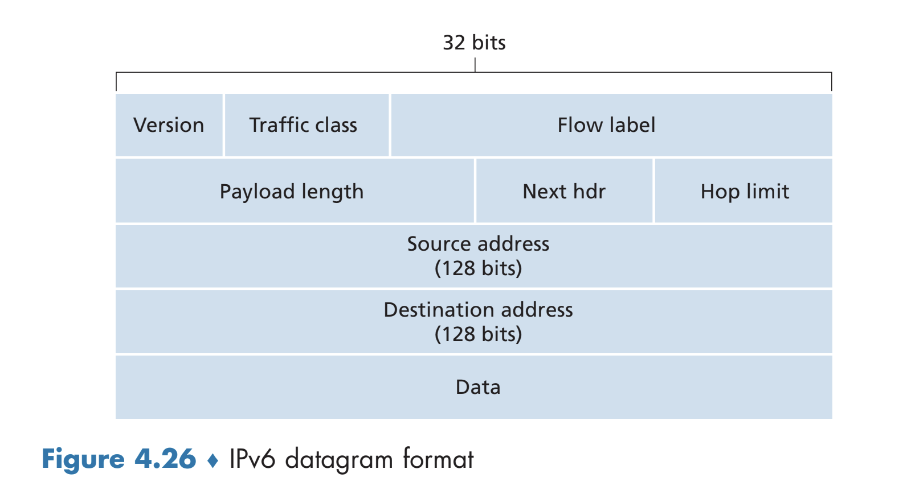
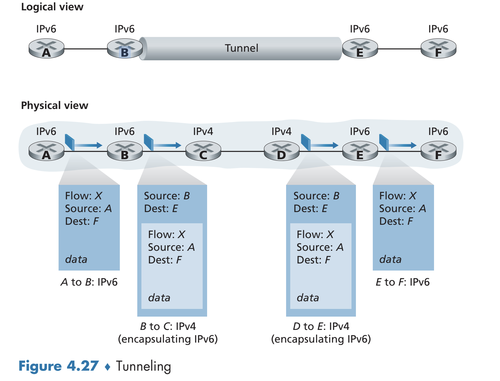
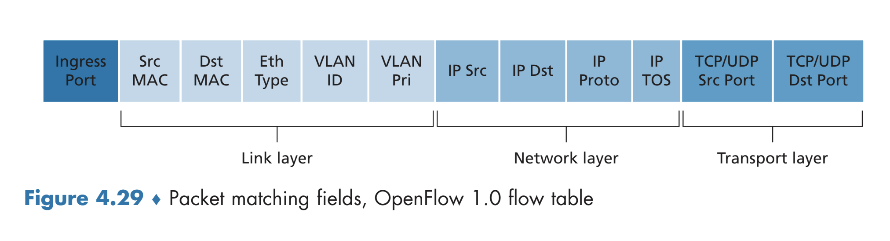
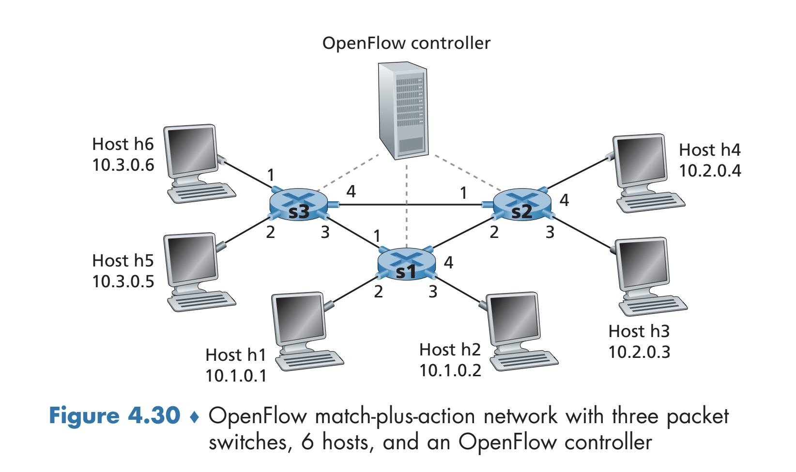

# The Network Layer: Data Plane
- The network layer can be split into the **data plane** and the **control plane**
	- The data plane determines, on a *per-router basis*, how datagrams arriving via the router's input links are forwarded via the router's output links
	- The control plane controls how a datagram is routed in the context of the *end-to-end* path between two hosts, often through the usage of *routing algorithms*
## 4.1 Overview of the Network Layer
- The network layer *encapsulates* a transport-layer segment from a sending host into a datagram and then sends this datagram to a nearby router, which extracts the appropriate header information from the datagram and then forwards the datagram to *another nearby router* - this process is repeated until it arrives at the destination host
	- The network layer coordinates these forwarding actions to ensure a best-effort delivery from one host to another
### Forwarding and Routing: The Data and Control Planes
- *Forwarding* refers to the action of the router moving a packet from one of many input links to the appropriate output link (there are also many output links)
	- Forwarding is typically implemented in direct *hardware*, and takes place in the order of nanoseconds
	- Forwarding is done by using values of a packet header to index into a **forwarding table**, which indicates which outgoing link to forward the packet to
		- Traditional network protocols have their forwarding tables configured by *the control plane* via routing algorithms
		- Under a **software-defined networking (SDN)** approach, forwarding tables are not set by the individual routers, but rather via an external controller (that the routers can communicate with), which is typically managed by an ISP
- *Routing* refers to the action of determining the route taken by packets as they go from sender to receiver - this pathing information can be used to determine future forwarding decisions (by updating the forwarding table)
	- Routing is typically implemented in *software*, and takes place in the order of seconds
### Network Service Model
- The *Internet's* **network service model** is a **best-effort service model**, meaning that it makes *no guarantees* that packets will be received or even a minimal bandwidth guarantee
## What's Inside a Router?
- 
	- The **input port** terminates the incoming link (from the physical layer) at the router and also performs a *forwarding table lookup* to determine which output port to forward the packet to (via the switching fabric)
		- Control packets are also forwarded from the input port to the router processor
	- The **switching fabric** connects the input ports to output ports
	- The **output port** stores packets received from the switching layer and transmits the packet on the link using the appropriate link layer and physical layer operations
	- The **routing processor** handles control-plane functions, such as maintaining routing tables and link state information as well as computing the forward table
- Forwarding can be *destination-based*, where the forwarding is done based on the end address of the packet, or forwarding can be *generalized*, where the forwarding is done based on the header information of the packet
### Input Port Processing and Destination-Based Forwarding
- The forwarding table is *computed* by the routing processor, but this table is copied from the processor to the line cards so that forwarding can be done *locally* at the input port without needing to consult the processor
	- This allows for forwarding to be much faster since there is no need to compute the processor - it can all be done solely through the hardware via in the input port
- Forwarding (destination-based) is done by matching a **prefix** of the packet's destination address to an appropriate entry in the forwarding table
	- Specifically, the **longest prefix** is matched
	- This lookup, performed in hardware, *must be fast* (in the order of nanoseconds), thus requiring the need for fast lookup algorithms and fast memory
- Lookup is not the only action that occurs at an input port: physical and link-layer processing must occur (routers implement physical and link layers in addition to the network layer), the packet's headers must be checked (e.g. checksum) and updated (e.g. time-to-live), and counters for network management must be incremented
### Switching 
- 
	- Old routers performed switching *via memory* by copying input packets into processor memory and then determining which output port (via the *processor*) to forward to, copying the memory contents into the output buffer
		- This approach is slower and inherently limited by the memory bandwidth (maximum forwarding throughput of $B/2$, where $B$ is the memory bandwidth)
		- This approach does not allow for packets to be forwarded *in parallel*
	- Switching can also be done via a *bus*, which does not require intervention via the processor
		- The input port will prepend an internal label to the packet and then transfer it to all output ports via the bus, but only the port for which the label matches will actually keep the packet (and remove the label)
		- This approach still does not allow for packets to be forwarded in parallel since only one packet can cross the bus at a time
		- The bottleneck in this case is the bus speed
	- Switching can also be done via an *interconnection network*, which consists of $2N$ buses, connecting $N$ input ports to $N$ output ports
		- This allows for packets to be forwarded in *parallel* and in a **non-blocking** manner, though two packets going to the *same* output port will still result in one of them being blocked until the other one is finished
### Where Does Queuing Occur?
- If a router's input and output line transmission rates are $R_{line}$, with $N$ input ports and $N$ output ports, and $R_{switch}$ is the fabric transfer rate, then as long as $R_{switch}$ is $N$ times faster than $R_{line}$, there will be negligible queuing delays at the *input*
	- If the fabric is not fast enough, though, queues *can form* - it can even be the case that packets experience **head-of-line blocking**, where packets must wait in the queue despite their corresponding output port being free because there is a packet *in front of them in queue*
		- 
- If many packets accumulate on a single output port, there is also queuing at the *output port* itself, since it can only send out one packet at a time
	- If there is not enough memory in an output port's buffer to hold all packets, it must **drop** a packet - whether it be the arriving packets or an already-arrived packet
	- There is a question of *how much* buffer space an output port should have
		- One suggestion is to base the buffer space based on the link capacity $C$ and $RTT$
			- $B = C(RTT)$
		- Another suggestion takes into account the number of independent TCP flows $N$
			- $B = RTT(C) / \sqrt{N}$
		- More buffer space is not necessarily better, as larger buffers, despite being able to hold *more packets*, suffer from larger queuing delays
		- **Bufferbloat** is an issue associated with long delay due to persistent buffering - such as from a burst of TCP packets that result in a persistent sending of acknowledgements (every time a packet is sent out, a new one arrives due to TCP acknowledgement)
### Packet Scheduling
- There are various scheduling mechanisms for an output queue (which is typically more common than input queues):
	- **First-in-first out** is based on the order in which packets arrive at the queue
	- **Priority queuing** is based on some classification of priority for each packet
		- Packets from the highest, non-empty priority class will be queued
	- **Round-robin queuing** sorts packets into classes, but then alternates service among these classes in a round-robin fashion
		- If the queuing is **work-conserving**, the scheduler will check the next available class for packets if the current class is empty - this ensures that it is always sending packets
		- A generalized implementation, known as **weighted fair queuing** by assigning each class a weight and serving packets based on this weight (each class receives a fraction of service $w_i / \sum w_j$)
## 4.2 - The Internet Protocol (IP): IPv4, Addressing, IPv6, and More
### IPv4 Datagram Format
- The **IPv4** protocol datagram is structured as follows:
	- 
		- *Version Number*: Specifies the version of the IP protocol
		- *Header Length*: IPv4 has *optional headers*, so the header length can be variable, hence the need to specify the header length
			- Typically, the optional headers are omitted so the length of a header is 20 bytes
		- *Type of Service*: Distinguishes different types of IP datagrams - e.g. real-time versus non-real-time traffic
		- *Datagram Length*: Total size of the datagram (header + payload)
		- *Identifier Flags, Fragmentation Offset*: Pertain to IP fragmentation, which is no longer done
		- *Time-to-Live (TTL)*: Ensures datagrams do not circulate forever in the network; this value is decremented each time a datagram is processed by a router, and if it reaches zero it is dropped
		- *Protocol*: Specifies the transport-layer protocol associated with the datagram 
			- This field is typically only used upon reaching the destination
		- *Header checksum*: Computes a checksum using each 2 bytes in the header (summing each of the 2 byte numbers in the header and then taking its 1's complement)
			- The checksum is computed and checked at each router - if an error is detected, the datagram is dropped
			- Since the time-to-live is part of the header and is updated each time it is processed by a router, the checksum must be recomputed each time as well (to account for a new time-to-live value)
			- Although TCP/UDP also perform check summing, it is still necessary for IPv4 as other transport layer protocols may *not* use check summing and hence would rely on the error detection provided by IPv4
		- *Data*: Most IP datagrams contain the *transport layer segment (usually TCP or UDP)* in the payload 
### IPv4 Addressing
- An IP address is not associated with a *host or router* but rather with an **interface** containing that host or router - view an interface as the *boundary* between a host/router and its outgoing links
	- Since routers may have multiple outgoing links, it will have *multiple* IP addresses
- In IPv4, addresses are 32 bits long and are expressed in **dotted decimal notation**, where each byte is written in decimal form and separated by a dot from the other bytes (e.g. address `193.32.216.9` in binary is `11000001 00100000 11011000 00001001`)
- A **subnet** is a network interconnecting host interfaces and/or router interfaces, whether it be via an ethernet LAN, wireless access point, or some other means
	- 
		- There are *three subnets* here, and each subnet shares a common *IP prefix* 
		- In **subnet mask** notation, a subnet can be assigned an address based on this common prefix 
			- e.g. `223.1.1.0/24` refers to the leftmost subnet, indicating that the leftmost 24 bits of the address (`223.1.1`) describe the subnet address and the remaining (32 - 24 = ) 8 bits describe a device *within the subnet*
			- Any device *within the subnet* must match the subnet mask (so, for example, any device in the leftmost subnet must be of the form `223.1.1.xxx)`
	- A router can interconnect *multiple subnets*
		- 
			- Here, there are *six* subnets
- Addressing with respect to the *global Internet* is done via **Classless Interdomain Routing (CIDR)**, which generalizes the notion of subnet addressing
	- An (IPv4) address is divided into two parts, similar to subnet addressing, `a.b.c.d/x`, where `x` is the number of bits in the first part (leftmost) of the address
	- The `x` significant bits (forming `a.b.c.d`) is the **prefix** of the address, and organizations are typically assigned blocks of contiguous addresses with a *common prefix*
		- In the context of forwarding, routers outside of an organization's network will only consider the `x` prefix bits - this reduces the required size of forwarding tables
		- Routers *within* an organization will only need to consider the remaining bits (32 - x), though these remaining bits may be subnetted even more within the organization
	- **Address aggregation** refers to the practice of using a single prefix to advertise multiple networks (e.g. an ISP containing multiple organizations), though in the complex case where certain networks do not match a single prefix, it may be necessary to advertise multiple prefixes
		- 
- A special type of IP address is `255.255.255.255`, which is known as a *broadcasting address* - a datagram sent with this destination will deliver the data to *all hosts on the same subnet*
#### Obtaining a Block Address
- To obtain a block address, an organization would contact the ISP, which would provide addresses from its larger block of addresses to the organization
- The ISP obtained its block of addresses from a global authority known as the Internet Corporation for Assigned Names and Numbers (ICANN)
#### Obtaining a Host Address: The Dynamic Host Configuration Protocol
- An organization can assign individual IP addresses to the host and router interfaces *within* the organization - this can be done manually or *dynamically* via **Dynamic Host Configuration Protocol (DHCP)**
- DHCP can be configured so that a host receives the same IP address each time it connects to the network or a **temporary IP address** each time
- DHCP also provides a host information about the subnet mask of the organization, the address of the first-hop (gateway router), the address of the local DNS server, and so forth
- DHCP is very useful for network administrators, as it automates the assignment of IP addresses 
	- e.g. A student with a laptop device that moves from a dorm to a classroom will move between different subnets, but DHCP is able to appropriately assign addresses in this scenario
- DHCP is a client-server protocol; each subnet has a DHCP server that an arriving client communicates with
	- 
	- The client discovers this DHCP server via a **DHCP discover message**, in which the client sends a UDP packet to port 67 to the *broadcast destination IP address* (`255.255.255.255`) and source address `0.0.0.0`
	- The receiving DHCP server(s) respond to the client with another *broadcast message* containing the proposed IP address of the client, the network mask, and an **address lease time**
	- The client can respond to one of the server offers (if there are multiple DHCP servers that sent an offer) directly with a **DHCP request message**, and the server responds back with a **DHCP ACK** confirmation
- One downside of DHCP involves the difficulty of maintaining a TCP connection as a host moves between different subnets (and therefore obtains different IP addresses which may hinder the TCP connection)
#### Network Address Translation (NAT)
- A simpler approach to IP address allocation is known as **network address translation (NAT)**
- A NAT-enabled router provides a subnet interface to a network (usually a home network)
	- Typically, the address space for the network is `10.0.0.0/24` is typically reserved for a **private network**
- Although this address space is not *unique* outside of the private network (in the global network), the NAT-enabled router *does* have a unique IP facing the global network
	- The NAT-enabled router assigns all connections leaving the private network its same IP address and distinguishes between these connections by assigning them a unique port number, which is stored in the **NAT translation table** for conversion
- 
	- When data is *sent*, the NAT router replaces the source IP address with its own IP address and the source port with the port number associated with the private network on the NAT table
	- When data is *received*, the NAT router replaces the destination IP address and port number with the appropriate entries from the NAT table
#### Firewalls and Intrusion Detection Systems
- **Firewalls** are installed between a network and the Internet
	- They inspect an incoming datagram and segment header fields and deny any suspicious datagrams from entering the internal network
	- They can also block packets based on source and destination IP addresses
- An **intrusion detection system** will perform even deeper packet inspections, examining both the header and payload of the packet and comparing them to a database of packet signatures from known attacks
	- Intrusion detection systems will create alerts on suspicious packets; intrusion prevention systems will actually block those suspcious packets
### IPv6
- The shrinking address space associated with IPv4 motivated the need for IPv6
#### IPv6 Datagram Format
- IPv6 addresses were increased from 32 bits to 128 bits
- Many header options were dropped or made optional, so the header is a *fixed-size* of 40 bytes, which allows for faster processing by a router
- Packets can be labeled as belonging to particular **flows**, of which may require special handling (e.g. real-time services) 
- 
	- *Version*: Specifies version, though additional measures must be taken to ensure backwards compatibility with IPv4
	- *Traffic Class*: Used to give priority for certain datagrams
	- *Flow Label*: Identifies the flow of the datagram
	- *Next Header*: Indicates which transport-layer protocol for which the contents of the datagram will be delivered
	- *Hop Limit*: Same as time-to-live
- IPv6 does not utilize header checksums, as the checksum functionality is already implemented in transport layer protocols (e.g. UDP and TCP) and is therefore redundant in context of the network layer
	- This was also motivated by the removing cost associated with having to recompute the header check sum each time the time-to-live (or hop) field 
#### Transitioning from IPv4 to IPv6
- The most common approach to ensuring compatibility between IPv4 and IPv6 is to utilize **tunneling**
	- An IPv6 node will take the entire IPv6 datagram (including the headers) and put it into the payload of an *IPv4* datagram, sending this datagram through an IPv4 node with the destination set to another IPv6 node (on the other side of the IPv4 "tunnel")
	- The datagram will go through the IPv4 router(s) until it reaches the IPv6 router, which will determine that the IPv4 datagram contains an IPv6 datagram, extract it, and send it onwards as it normally would under the IPv6 protocol
- 
## Generalized Forwarding and SDN:
- The **match-plus-action** paradigm is common in computer network design, where a "match" associated with a certain header field value incurs an "action" associated with that field (such as forwarding, load balancing, blocking a packet, etc.)
- A match-plus-action table (also known as a **flow table**) is typically computed, installed, and updated by a remote controller, and this table will contain information about header fields to which an incoming packet is matched, a set of counters that are updated as packets are matched to flow table entries, and a set of actions to be taken when a packet matches a flow table entry 
### Match
- A match can be made *across* different protocol layers (link, network, transport)
- Under OpenFlow, a standard for match-plus-action flow tables, various fields can be matched:
	- 
	- The ingress port is the input port on the packet switch (or router)
	- Flow table entries can be wildcarded
	- Entries have priorities, so a packet matching multiple entries will match the one with highest priority
	- Not all fields can be matched, such as TTL or datagram length, due to the complexity associated with implementing the matching of such fields
### Action
- There are many possible actions that can be performed upon a match
- A *forward* action can forward a packet to a specific physical output port, broadcasted over all ports, multicasted over a set of ports, or even be sent to the remote controller for the device
- A *drop* action typically occurs when a packet does not match any entries in the flow table
- A *modify-field* action may re-write certain fields before forwarding the packet
### Examples
- 
- **Simple Forwarding**: Consider forwarding packets that have their source as h5 or h6 and destination to h3 or h4 from routers s3 to s1 and then from s1 to s2
	- On S3:
		- `Match: IP Src = 10.3.*.*; IP Dst = 10.2.*.*`; `Action: Forward(3)`
	- On S1:
		- `Match: Ingress Port = 1; IP Src = 10.3.*.*; IP Dst = 10.2.*.*`; `Action: Forward(4)`
	- On S2: 
		- `Match: Ingress Port = 2; IP Dst = 10.2.0.3`; `Action: Forward(3)`
		- `Match: Ingress Port = 2; IP Dst = 10.2.0.4`; `Action: Forward(4)`
- **Load Balancing**: Consider having datagrams from h3 with destination 10.1.\*.\* forwarded to s1 while datagrams from h4 with destination 10.1\*.\*. forwarded to s3; in this case, s2 acts as a *load balancer*, appropriately directing traffic between the two possible links so that all the traffic does not immediately go through s1 (though the traffic from s3 must still go to s1 eventually)
	- On S2:
		- `Match: Ingress Port = 3; IP Dst = 10.1.*.*`; `Action: Forward(2)`
		- `Match: Ingress Port = 4; IP Dst = 10.1.*.*`; `Action: Forward(1)`
- **Firewalling**: Consider having s2 want to receive only traffic sent from hosts attached to s3 - this is a *firewall*
	- On S2:
		- `Match: IP Src = 10.3.*.*; IP Dst = 10.2.0.3`; `Action: Forward(3)`
		- `Match: IP Src = 10.3.*.*; IP Dst = 10.2.0.4`; `Action: Forward(4)`
- Flow tables are useful because of the *programmability* they offer
## Middleboxes
- **Middleboxes** are intermediary devices that perform functionality different from standard IP functionality on the data path between a host and destination
	- Examples of middleboxes include web caches, TCP connection splitters, network address translation (NAT) routers, firewalls, and so forth
- The rise of middleboxes go against the philosophy of separation of protocol stack layers, though they are a nonetheless needed part of it
## Architectural Principles of the Internet
- **IP Hourglass**: There can be various application, transport, and link layer protocols but there can only be *one* network layer protocol - the IP protocol
- **End-to-End Argument**: Complete functionality for communication between two end points *require* those end points to contribute to such functionality
	- Consider, for example, error checking
