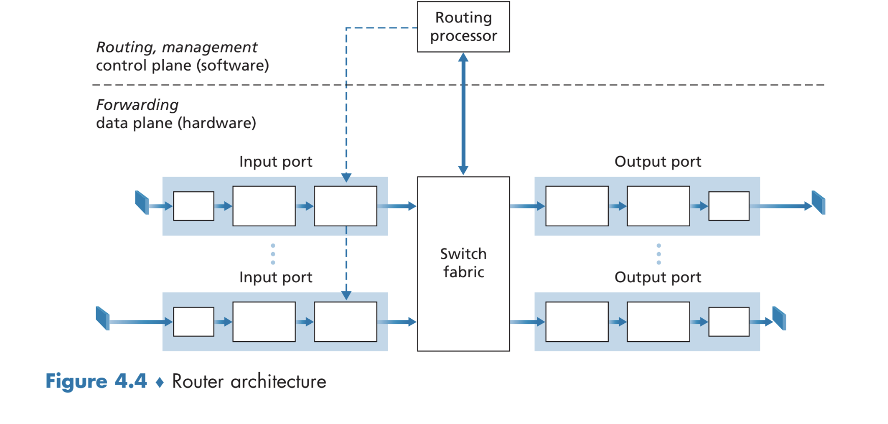
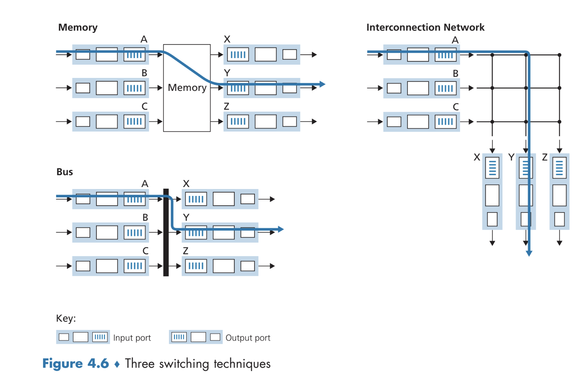
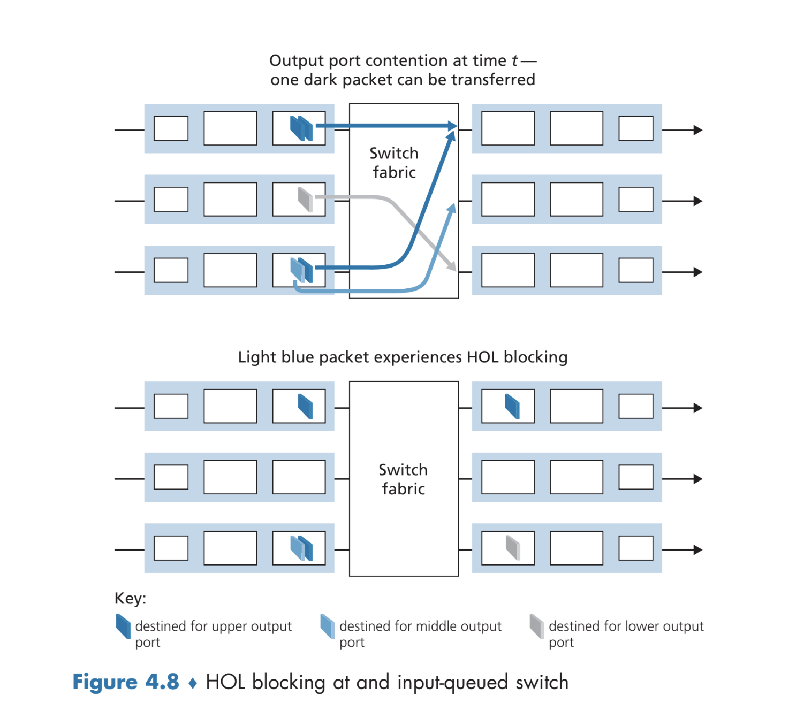

# The Network Layer: Data Plane
- The network layer can be split into the **data plane** and the **control plane**
	- The data plane determines, on a *per-router basis*, how datagrams arriving via the router's input links are forwarded via the router's output links
	- The control plane controls how a datagram is routed in the context of the *end-to-end* path between two hosts, often through the usage of *routing algorithms*
## 4.1 Overview of the Network Layer
- The network layer *encapsulates* a transport-layer segment from a sending host into a datagram and then sends this datagram to a nearby router, which extracts the appropriate header information from the datagram and then forwards the datagram to *another nearby router* - this process is repeated until it arrives at the destination host
	- The network layer coordinates these forwarding actions to ensure a best-effort delivery from one host to another
### Forwarding and Routing: The Data and Control Planes
- *Forwarding* refers to the action of the router moving a packet from one of many input links to the appropriate output link (there are also many output links)
	- Forwarding is typically implemented in direct *hardware*, and takes place in the order of nanoseconds
	- Forwarding is done by using values of a packet header to index into a **forwarding table**, which indicates which outgoing link to forward the packet to
		- Traditional network protocols have their forwarding tables configured by *the control plane* via routing algorithms
		- Under a **software-defined networking (SDN)** approach, forwarding tables are not set by the individual routers, but rather via an external controller (that the routers can communicate with), which is typically managed by an ISP
- *Routing* refers to the action of determining the route taken by packets as they go from sender to receiver - this pathing information can be used to determine future forwarding decisions (by updating the forwarding table)
	- Routing is typically implemented in *software*, and takes place in the order of seconds
### Network Service Model
- The *Internet's* **network service model** is a **best-effort service model**, meaning that it makes *no guarantees* that packets will be received or even a minimal bandwidth guarantee
## What's Inside a Router?
- 
	- The **input port** terminates the incoming link (from the physical layer) at the router and also performs a *forwarding table lookup* to determine which output port to forward the packet to (via the switching fabric)
		- Control packets are also forwarded from the input port to the router processor
	- The **switching fabric** connects the input ports to output ports
	- The **output port** stores packets received from the switching layer and transmits the packet on the link using the appropriate link layer and physical layer operations
	- The **routing processor** handles control-plane functions, such as maintaining routing tables and link state information as well as computing the forward table
- Forwarding can be *destination-based*, where the forwarding is done based on the end address of the packet, or forwarding can be *generalized*, where the forwarding is done based on the header information of the packet
### Input Port Processing and Destination-Based Forwarding
- The forwarding table is *computed* by the routing processor, but this table is copied from the processor to the line cards so that forwarding can be done *locally* at the input port without needing to consult the processor
	- This allows for forwarding to be much faster since there is no need to compute the processor - it can all be done solely through the hardware via in the input port
- Forwarding (destination-based) is done by matching a **prefix** of the packet's destination address to an appropriate entry in the forwarding table
	- Specifically, the **longest prefix** is matched
	- This lookup, performed in hardware, *must be fast* (in the order of nanoseconds), thus requiring the need for fast lookup algorithms and fast memory
- Lookup is not the only action that occurs at an input port: physical and link-layer processing must occur (routers implement physical and link layers in addition to the network layer), the packet's headers must be checked (e.g. checksum) and updated (e.g. time-to-live), and counters for network management must be incremented
### Switching 
- 
	- Old routers performed switching *via memory* by copying input packets into processor memory and then determining which output port (via the *processor*) to forward to, copying the memory contents into the output buffer
		- This approach is slower and inherently limited by the memory bandwidth (maximum forwarding throughput of $B/2$, where $B$ is the memory bandwidth)
		- This approach does not allow for packets to be forwarded *in parallel*
	- Switching can also be done via a *bus*, which does not require intervention via the processor
		- The input port will prepend an internal label to the packet and then transfer it to all output ports via the bus, but only the port for which the label matches will actually keep the packet (and remove the label)
		- This approach still does not allow for packets to be forwarded in parallel since only one packet can cross the bus at a time
		- The bottleneck in this case is the bus speed
	- Switching can also be done via an *interconnection network*, which consists of $2N$ buses, connecting $N$ input ports to $N$ output ports
		- This allows for packets to be forwarded in *parallel* and in a **non-blocking** manner, though two packets going to the *same* output port will still result in one of them being blocked until the other one is finished
### Where Does Queuing Occur?
- If a router's input and output line transmission rates are $R_{line}$, with $N$ input ports and $N$ output ports, and $R_{switch}$ is the fabric transfer rate, then as long as $R_{switch}$ is $N$ times faster than $R_{line}$, there will be negligible queuing delays at the *input*
	- If the fabric is not fast enough, though, queues *can form* - it can even be the case that packets experience **head-of-line blocking**, where packets must wait in the queue despite their corresponding output port being free because there is a packet *in front of them in queue*
		- 
- If many packets accumulate on a single output port, there is also queuing at the *output port* itself, since it can only send out one packet at a time
	- If there is not enough memory in an output port's buffer to hold all packets, it must **drop** a packet - whether it be the arriving packets or an already-arrived packet
	- There is a question of *how much* buffer space an output port should have
		- One suggestion is to base the buffer space based on the link capacity $C$ and $RTT$
			- $B = C(RTT)$
		- Another suggestion takes into account the number of independent TCP flows $N$
			- $B = RTT(C) / \sqrt{N}$
		- More buffer space is not necessarily better, as larger buffers, despite being able to hold *more packets*, suffer from larger queuing delays
		- **Bufferbloat** is an issue associated with long delay due to persistent buffering - such as from a burst of TCP packets that result in a persistent sending of acknowledgements (every time a packet is sent out, a new one arrives due to TCP acknowledgement)
### Packet Scheduling
- There are various scheduling mechanisms for an output queue (which is typically more common than input queues):
	- **First-in-first out** is based on the order in which packets arrive at the queue
	- **Priority queuing** is based on some classification of priority for each packet
		- Packets from the highest, non-empty priority class will be queued
	- **Round-robin queuing** sorts packets into classes, but then alternates service among these classes in a round-robin fashion
		- If the queuing is **work-conserving**, the scheduler will check the next available class for packets if the current class is empty - this ensures that it is always sending packets
		- A generalized implementation, known as **weighted fair queuing** by assigning each class a weight and serving packets based on this weight (each class receives a fraction of service $w_i / \sum w_j$)
