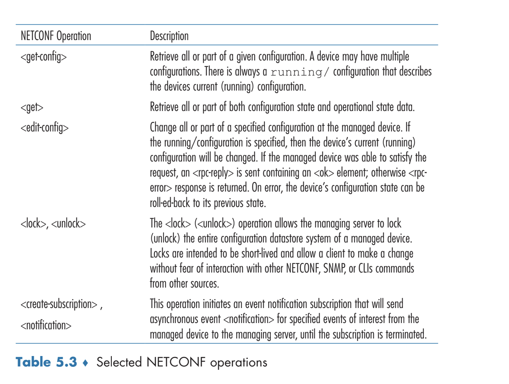

# The Network Layer: Control Plane
- The **control plane** handles *network-wide* logic, such as routing and how network-layer services and components are configured and managed
## Introduction
- Routing algorithms can run *per router*, where each router possesses a routing component that communicates with routing components in other routers to compute its forwarding tables
- Routing algorithms can also run via a *logically centralized controller*, which computes and distributes the forwarding tables to be used by every router
	- The controller interacts with routers' *control agents*; these control agents *only* interact with the controller - they do not interact with other routers
## Routing Algorithms
- **Routing algorithms** are used to determine efficient paths from senders to receivers
	- These algorithms are in the context of graphs, where networks are nodes and links between these networks are edges
		- The cost of an edge is typically associated with the length of the link, the link speed, or the monetary cost
	- Routing algorithms try to find the **shortest path** between two networks
- **Centralized routing algorithms** compute the shortest path using *global information* about the network (e.g. acquired from a logically centralized controller)
	- Algorithms with global information are known as **link-state algorithms**
- **Decentralized routing algorithms** compute the shortest path in a distributed, iterative manner by the routers, of which do not have complete information about the cost of all network links 
	- Routers exchange information with their neighbors and use this information to gradually compute a shortest path
- **Static routing algorithms** change shortest path routes *slowly over time* whereas **dynamic routing algorithms** change the routing paths as the network traffic or topology changes (done either periodically or in response to changes)
- **Load-sensitive algorithms** vary link costs in response to the congestion on that link
	- Most routing algorithms today are **load-insensitive**
### The Link-State Routing Algorithm
- Dijkstra's algorithm can be used to compute least-cost routes given global knowledge about a routers
	-     N' = {u}
		  for all nodes V
			  if V is a neighbor of u
				  then D(v) = c(u, v)
			  else
				  D(v) = infinity
		  Loop until N' = N
			  find w not in N' such that D(w) is a minimum
			  add w to N'
			  update D(v) for each neighbor v of w and not in N':
				  D(v) = min(D(v), D(w) + c(w, v))
	 - The predecessor nodes acquired from the algorithm can be used to construct the least-cost path, and this path can be used to set the forwarding tables in a node
 - One issue with the link-state routing algorithm arises when the topology where link costs are equal to the load carried on the link - this can cause *oscillation*
	 - 
	 - One solution to this problem is to ensure that not all routers run the link-state routing algorithm at the same time
### The Distance-Vector (DV) Routing Algorithm
- The distance-vector algorithm leverages the recurrence: $d_x(y) = min_v(c(x, v) + d_v(y))$
- In the Distance-Vector algorithm, each node maintains the cost to its direct neighbors $c(x,v)$ and distance vectors that acts as estimates of the distance from that router to *all possible nodes* $D_x=[D_x(y): y \in N]$
	- Periodically, each node sends a copy of its distance vector to its neighbors; upon receiving a distance vector, the neighbor should update its *own* distance vector according to the aforementioned recurrence
- Algorithm:
	-     Initialization
			for all destinations y in N:
				D_x(y) = c(x, y) // if y is not a neighbor, c = infinity
			for each neighbor w
				// The distance vectors of the neighbors are not yet known
				D_w(y) = ? for all destinations y in N
			for each neighbor w
				send distance vector D_x = [D_x(y): y in N] to w
		  loop forever:
			  wait until a link cost changes relative to a neighbor
			  OR a distance vector is received:
			 
			 for each y in N:
				 D_x(y) = min_v{c(x, v) + D_v(y)}
			 if D_x(y) changed for any destination y:
				 send distance vector D_x = [D_x(y): y in N] to all neighbors
	 - The next-hop router that a given router should forward to given a destination is based on the neighboring path that achieves the minimum according to the recurrence
- Example: 
	- 
	- Initially, each node only has information regarding its direct neighbors
	- After receiving the first set of distance vectors from each of its neighbors, each router updates its own distance vectors accordingly
		- e.g. For x:
			- $D_x(x) = 0$
			- $D_x(y) = min(c(x, y) + D_y(y), c(x, z) + D_z(y)) = min(2 + 0, 7 + 1) = 2$
			- $D_x(z) = min(c(x, y) + D_y(z), c(x, z) + D_z(z)) = min(2 + 1, 7 + 0) = 3$
	- The routers that actually updated their distance vectors (found new minima), then send their updated distance vectors to all their neighbors (e.g. $x$ and $z$ sent their respective distance protocols to all of their neighbors)
- When the cost of a link between a router and its neighbor changes, the distance vector algorithm will update its distance vector and, if there is a change in least-cost path, will inform its neighbors accordingly
	- This performs well if costs decrease, but can suffer in certain cases if costs *increase*
	- 
		- Before the cost changes, the distance vectors are $D_y(x) = 4$, $D_y(z) = 1$, $D_z(x) = 5$
		- When the cost changes, $y$ recomputes its distance vector as $D_y(x) = min(c(y, x) + D_x(x), c(y, z) + D_z(x)) = min(60 + 0, 1 + 5) = 6$
			- This information is *wrong*, as *z*'s shortest path was under the assumption that the cost did not change (that it could route through y to get to x)
			- At this update step, a packet may get stuck in a **routing loop**, a packet from *y* would route to *z*, which would then route it back to *y* - this will continue until the distance vectors are updated
		- Once *y* updates its cost, it sends its vectors to *z*, which then recomputes its own distance vectors
			- $D_z(x) = min(50 + 0, 1 + 6) = 7$
		- *z* will then send its updated distance vectors to *y*, which will then recompute 
			- $D_y(x) =  8$
		- This will go back and forth, increasing the updated distances *one at a time* until the correct distances are reached
			- This involves *44* iterations
	- The aforementioned issue can be mitigated via the *poisoned reverse technique*, though this technique will not always fix the issue
		- If a node *a* routes through another node *b* to get to destination *c*, *a* will advertise to *b* that its distance to *c* is infinity as long as it routes to *c* through *b*
		- In the previous case:
			- *z* will indicate to *y* that $D_z(x) = \infty$ since it is initially using *y* to get to *x*
			- When the link cost changes, *y* will update its distance vectors such that $D_y(x) = 60$ and *z* will correspondingly update its distance vectors such that $D_z(x) = 50$ (after receiving the update from *y*)
				- Since *z* is no longer using *y* to get to *x*, it unpoisons its reverse path, and indicates to *y* that actual distance to from *z* to *x* is 50
			- After *z* updates and sends to *y*, router *y* will update its distance vectors so that $D_y(x) = 51$, but now *y* will also poison the reverse path and indicate to *z* that $D_y(x)=\infty$ since now *y* is using *z* to get to *x*
			- Doing this prevents the long time to update *in this case*, but loops with three or more nodes may still suffer from the issue
## Intra-AS Routing in the Internet: OSPF
- In practice, a network is not simply a collection of interconnected routers, indistinguishable from each other, but rather a collection of **autonomous systems (ASs)**, which contain a group of routers under the same administrative control
	- Typically, routers in an ISP and the links that connect them are a single AS
- Routers *within* the same AS all have information about each other and run the same routing algorithm, known as an **intra-autonomous system routing protocol**
### Open Shortest Path First (OSPF)
- The **Open Shortest Path First (OSPF)** protocol uses the flooding of link-state information and Dijkstra's algorithm to determine the shortest path to all subnets from each router
- How the link costs are chosen is up to the network administrator
	- They can all be set to one to achieve minimum-hop routing
	- Alternatively, they can be set to be inversely proportional to the link bandwidth to discourage traffic on low-bandwidth links
- With OSPF, a router broadcasts information to *all* other routers in the AS, not just its neighboring routers
	- There are broadcasts whenever there is a change in the link's state (like cost) and there are also periodic broadcasts to ensure robustness
	- These broadcast advertisements are carried via IP and use an upper-layer protocol that implements functionality such as reliable data transfer and link-state broadcast
- Advanced OSPF Features:
	- Security: By default OSPF messages are not authenticated, but they can be authenticated to ensure that only trusted routers (like those in the same AS) can participate in the protocol
		- This can be done via hashing secret keys that are configured in all routers in the AS
	- Multiple Same-Cost Paths: If multiple paths have the same cost, then any can be used
	- Integrated Support for Unicast and Multicast Routing
	- Support for Hierarchy within a Single AS: An AS can be configured hierarchically into areas, each of which run its own OSPF algorithm and possess border routers to communicate information to other areas (usually through routers in the *backbone area*)
## Routing Among the ISPs: BGP
- Routing *across* an autonomous system requires making use of an **inter-autonomous system routing protocol**, with the one used across the Internet being the **Border Gateway Protocol (BGP)**
### The Role of BGP
 - Entries for a destination within the same autonomous system are determined by the intra-AS routing protocol
 - With inter-AS routing, packets are not routed to a specific destination address but rather a prefix representing a subnet 
	 - Forwarding table entries will be of the form *(x, I)*, where *x* is the prefix and *I* is an interface number for one of the router's interfaces
 - BGP functions by enabling routers to obtain prefix reachability information from nearby autonomous systems through advertisement and by enabling routers to determine the relatively *best* routes to the prefixes
### Advertising BGP Route Information
- Within an autonomous system, a router can either be a **gateway router**, which sits on the edge of an autonomous system (and therefore connects to routers in other autonomous systems) or an **internal router**
- To advertise reachability for prefix *x*, an autonomous system sends a message to nearby autonomous systems about the path, and these autonomous systems then send messages to *their* nearby autonomous systems, adding on to the advertised path
	- e.g. A prefix *x* originating in AS3 can be advertised by AS3 to AS2 via the message `AS3 x`, and then AS2 can advertise this to AS1 via the message `AS2 AS3 x`
	- Communication is done via routers, typically over semi-permanent TCP connections over port 179
		- This connection, which sends BGP messages, is known as a **BGP connection**; an **external BGP (eBGP)** connection spans across ASs whereas an **internal BGP (iBGP)** connection spans within an AS
	- Information is propagated using *both* iBGP and eBGP connections 
		- 
### Determining the Best Routes
- When a prefix is advertised across a BGP connection, the message also contains several **BGP attributes** - a prefix along with its attributes constitutes a **route**
	- The `AS-PATH` attribute contains a list of the autonomous systems the advertisement has passed through (e.g. `AS2 AS3 x`)
	- The `NEXT-HOP` attribute contains the IP address of the router interface that begins the `AS-PATH`
		- In the previous example, for the path `AS2 AS3 x`, the `AS-PATH` field would be the IP address of router 2a
- Using these attributes, BGP utilizes **hot potato routing**, where the best possible route chosen among many possible routes is the route that has the least cost to the `NEXT-HOP` router from the current router
	- Example:
		- 
		- From router 1b, the least-cost intra-AS path to `NEXT-HOP` is the one that goes to router 2a, so router 1b's forwarding table will be configured to include *(x, I)*, where *I* is the interface on the least-cost path to router 2a
- 
- In practice, BGP utilizes the following criteria for the best path:
	- If a route has a **local preference** value on its attributes (which is typically set as a policy decision by the network administrator), then this route will be prioritized over others that go to the same prefix
	- If there are ties with local preference, the route with the shortest `AS-PATH` is prioritized
	- If there are ties with length of `AS-PATH`, then the shortest `NEXT-HOP` route is prioritized 
### IP-Anycast
- BGP has an additional use of implementing the IP-anycast service, which when content is replicated among many different servers in different geographical locations and users are served this content based on proximity
	- DNS relies on IP-anycast
- 
	- The CDN assigns the same IP address to each of its servers and leverages BGP to advertise this IP address from each of its servers
	- A router will receive *multiple route advertisements* for the same IP address (because each server advertises), but will select the *closest* one based on its routing algorithm
	- Thus, a client requesting content can receive content from the closest geographical region 
### Routing Policy
- Routing policy can have more influence over the routes chosen compared to shortest path or hot potato routing
- Example:
	- 
	- Here, *x* is **multi-homed**, meaning it connects to *multiple* access ISPs
		- However, *x* does not want to forward traffic on behalf of the ISPs, so it will not advertise paths to destinations to *B* or *C*
			- Although *x* does know of a path to, for example, *y* in the form of *xCy*, it will not advertise this path to *B* because otherwise *B* might forward unwanted traffic destined to *y* via *x*
	- Consider *B*, which is aware of the path *AW* 
		- *B* will advertise *BAw* to its customer *x* so that *x* can route to *w* 
		- There is a question, though, of whether *B* should advertise *BAw* to *C*, because if it did then *C* could route traffic to *BAw* and thus place more burden on *B*
			- The general rule of thumb is that any traffic flowing across an ISP's backbone must either have a source or destination in the network that is a customer of that ISP (otherwise the ISP is allowing for a free ride of traffic through its routers)
## The SDN Control Plane
- SDN architecture is based on:
	- *Flow-based forwarding*: Forwarding done by SDN-controlled switches is based on any number of header fields; the rules for forwarding are specified in the switch's *flow table*
	- *Separation of data and control plane*: The data plane consists of switches that perform the forwarding whereas the control plane consists of the servers and controllers that manage the flow tables of these switches
	- *Network control functions external to data-plane switches*: The control plane is implemented in *software* that is executed *remotely* from the switches
		- Typically, there is an SDN controller and a set of network-control applications
	- *A programmable network*: The network is programmable through network applications running in the control plane, typically through some set of APIs
- 
### SDN Controller and SDN Network-Control Applications
- The *controller* portion of the SDN control plane has various functionality:
	- It serves as a *communication layer* between the network-controlled devices and the SDN controller
		- Communication may involve setting the flow tables of the devices as well as receiving information about locally observed events from devices (such as a switch going down) so that the controller has an accurate view of the network state
		- Communication is typically done via OpenFlow or SNMP
	- There is also a *state-management layer*, as the decisions made by the SDN control plane requires having information about the state of the network's hosts, links, switches, and so forth
		- Flow tables typically contain counters, which can also be sent to the controller to keep track of state
	- There is also an interface to the *network-control application layer*, which allows for network management applications (such as those implementing load balancers, proxies, etc.) 
- SDN controllers are *logically centralized*, but in practice they are implemented via a set of distributed servers 
- 
### OpenFlow Protocol
- OpenFlow allows for a controller to communicate with network switches; this communication is done via TCP over port 6653
- Typical OpenFlow messages:
	- Controller to Switch:
		- *Configuration*: Query and set a switch's configuration parameters
		- *Modify-State*: Add/delete entries in the flow table
		- *Read-State*: Read entries in the flow table (e.g. counters)
		- *Send-Packet*: Send a specific packet out of a specified port at the controlled switch
	- Switch to Controller:
		- *Flow-Removed*: Inform the controller that a flow table entry has been removed
		- *Port-Status*: Inform the controller of a change in port status
		- *Packet-In*: Send a matched packet to the controller if the action specifies doing so
### Case Studies:
- OpenDaylight Controller:
	- 
- ONOS Controller:
	- 
### Example
- With SDN, routing can be done in a more centralized manner, as a network control application can use the API to the SDN controller to acquire a network graph and then perform Dijkstra's algorithm to compute the shortest paths in the network, which it can then send back to the SDN controller which then accordingly updates the flow tables of the switches
	- If a switch, for instance, experiences a link failure, it can notify the SDN controller (`Port-Status`) via OpenFlow, and then this controller can notify the link-state manager which updates its database
	- The network control application that manages routing can be notified of a link state change and can compute the new costs accordingly and send these costs to the flow table manager, which will then update the flow tables of the affected switches via OpenFlow
## ICMP: The Internet Control Message Protocol
- The **Internet Control Message Protocol** is used by hosts and routers to communicate network-layer information - typically information pertaining to errors
- ICMP lies above IP, as the messages are carried inside IP datagrams
- 
- The Traceroute program is implemented using ICMP messages, as it sends a series of ordinary UDP messages to a destination with an increasing set of TTL fields
	- When the *nth* datagram arrives at the *nth* router, the router will observe the TTL expiring and send ICMP error type 11
	- The Traceroute program sends the UDP message with an unlikely destination port, so that when a datagram *does* arrive at the destination, it will be returned with ICMP error type 3 code 3
	- As the ICMP messages are sent back, the host can estimate the RTTs over the routers
## Network Management and SNMP, NETCONF/YANG
### The Network Management Framework
- 
	- The *managing server* is an application running in a centralized network management station in the network operations center
		- It controls the collection, processing, analysis, and dispatching of network management information
	- The *managed device* is a piece of network equipment that resides on a managed network (e.g. host, router, switch, etc.) and will typically have manageable components and configuration parameters
	- Devices can have **configuration data**, which is device-specific information, **operation data**, which is information that the device acquires as it operates (e.g. immediate neighbors to a switch), as well as **device statistics**
		- Device data is typically queried by the network manager
	- A *network management agent* is a piece of software running in a managed device that communicates with the managing server and takes local actions in response to the server
	- A *network management protocol* runs between the managing server and the managing devices
- Common Ways to Manage a Network:
	- **Command Line Interface**: A network operator can issue commands via a terminal to manage a network
		- This approach is prone to error and does not scale well with large-sized networks
	- **SNMP/MIB**: A network operator can query and set the data contained in a device's **Management Information Base (MIB)** using the **Simple Network Management Protocol (SNMP)**
		- This approach requires managing the devices *individually*
	- **NETCONF/YANG**: The NETCONF protocol is used to communicate **YANG** (a data modeling language used to model configurations) compatible actions to and from remote devices
### The Simple Network Management Protocol (SNMP) and the Management Information Base (MIB)
- The **Simple Network Management Protocol (SNMP)** is an application layer protocol to convey network-management control information between a server and an agent (on a device)
	- Typically, requests involve retrieving or modifying a management information base (MIB) object associated with a device, though it is also common for an agent to send a *trap message* to a server so that a managing server is notified when an exceptional situation occurs (e.g. link interface going down)
	- SNMP is typically run over UDP, and so it is up to the server to determine how to handle retransmissions
	- 
- A device's operational state data are represented as objects that gather together in a **management information base (MIB)** for that object
	- An example of an object may involve a counter keeping track of the number of IP datagrams discarded at the router due to errors
### The Network Configuration Protocol (NETCONF) and YANG
- The **Network Configuration Protocol (NETCONF)** defines messages that allows a managing server to *retrieve, set, and modify configuration data at managed devices*, to *query operational data and statistics at devices*, and to *subscribe to notifications generated by managed devices*
- Devices are controlled by managing servers by sending such devices configurations (in XML format) and activating the configuration at the managed device remotely
	- These messages are sent over TCP (specifically a secure version that uses TLS)
- 
- **YANG** is the data modeling language used to specify the structure, syntax, and the semantics of network management data used by NETCONF
