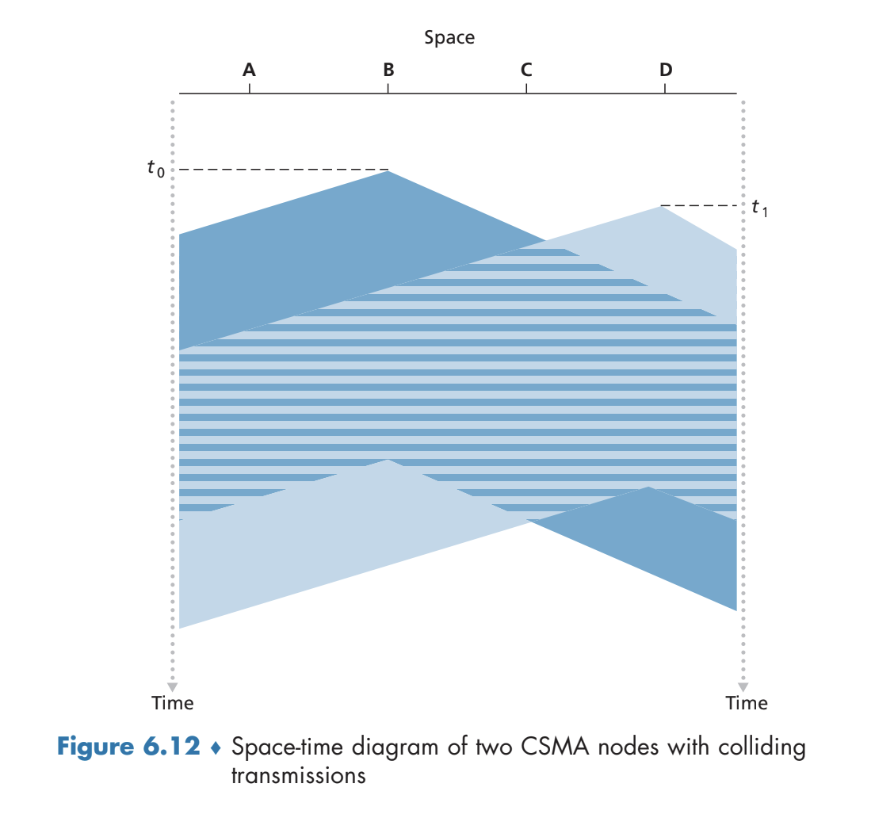
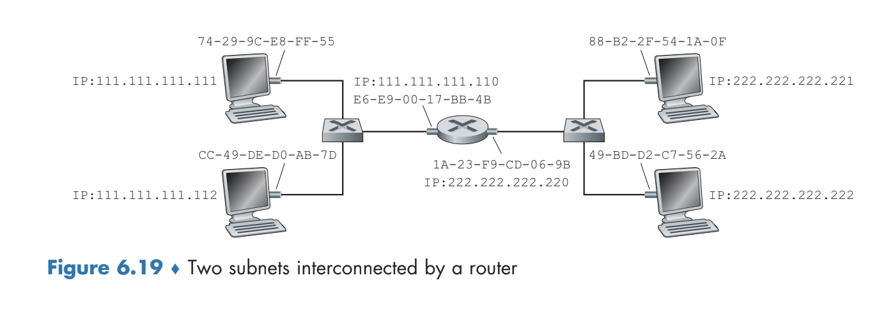

# The Link Layers and LANs
- The link layer concerns itself with how packets are sent across *individual links* that make up an end-to-end communication path
- There are two types of link layer channels:
	- Broadcast channels connect *multiple* hosts and therefore require a media access protocol to coordinate the transmission of frames from the many different sources 
	- Point-to-point channels connect only two hosts directly and therefore do not require complex media access protocols to manage
## Introduction to the Link Layer
- Any device that runs a link layer protocol is known as a **node**
	- e.g. Hosts, routers, switches, WiFi access points
- The communication channel that connects two adjacent nodes is known as a **link**
	- Datagrams are transferred from source host to destination host by moving over *each individual link* in the end-to-end path
	- Over a given link, the transmitting node encapsulates the datagram (from the network layer) into a **link-layer frame**
### Services Provided by the Link Layer
- *Framing*: Link layer protocols encapsulate data into frames, which contains the payload plus headers
	- The structure of the frame is specified by the specific link layer protocol (e.g. different frame for ethernet versus WiFi)
- *Link Access*: A media access control (MAC) protocol specifies the rules by which a frame is transmitted onto a link (important for the case where *multiple* nodes share a single broadcast link)
- *Reliable Delivery*: Some (but not all) link layer protocols provide reliable delivery guarantees - this is common for error-prone links such as WiFi but not so common for more stable links such as fiber or coax
- *Error Detection and Correction*: A node may be able to determine bit errors via some error detection mechanism and, in some cases, even correct the error after determining where it had occurred
### Link Layer Implementation
- Most link layer functionality is implemented in hardware, typically through a **network adapter** (also known as a **network interface controller**), where a sender takes a higher layer datagram, encapsulates it into a link layer frame, and finally transmits the frame under the specified link access protocol and a receiver controller receives the frame and extracts the network layer datagram
- Some portion of the link layer is implemented in software, typically dealing with tasks such as assembling link-layer addressing information and activating the controller hardware as well as responding to controller interrupts whenever a frame is received
## Error Detection and Correction Techniques
- Given data $D$ and error-detection and correction bits $EDC$ sent through a link, the goal is to determine if the received $D'$ and $EDC'$ differ from the original due to bit flips
	- Error detection techniques *do not guarantee* that an error is detected, as it is possible for there to be **undetected bit errors**
### Parity Checks
- A single parity check makes use of a **parity bit**, which, in an even parity scheme, is chosen such that the total number of bits that are 1 in the entire frame (including the parity bit) is even; in an odd parity scheme, the parity bit is chosen such that the total number of bits that are 1 in the entire frame is odd
	- Even: The number of ones in the $d + 1$ bits is even
	- Odd: The number of ones in the $d + 1$ bits is odd
	- This scheme will fail if an even number of bit errors occur, and it has been shown that, in practice, bit errors typically come in *bursts* - so there is roughly a 50 percent chance that the error is picked up using just a single parity bit
- A **two dimensional parity** scheme divides the data $d$ into $i$ rows and $j$ columns , computing a parity value for each row and each column
	- With this, when a bit error occurs, *which bit was flipped* can be identified and corrected
		- Only a single bit error can be corrected; if there are multiple bit errors, it may be possible to recognize that bit errors have occurred, but it will not be possible to identify which bits were flipped
		- 
	- The ability for **forward error correction** can allow for the immediate correction of a bit error at the reciever, reducing the need for retransmission at higher layers
### Checksumming Methods
- Another error detection method is to take the **Internet checksum** of the data:
	- Sum the 16-bit segments of the data and take the 1's complement to form the Internet checksum
	- The receiver takes the sum of the received data and the Internet checksum and checks whether the result is all 1's
- Checksumming methods are typically weak compared to other methods and also are typically only used in the transport layer
	- At the transport layer, error detection is implemented in software and therefore must be simple and fast (because software is not as fast as hardware)
	- Hardware allows for more sophisticated error detection methods
### Cyclic Redundancy Codes
- A commonly used error detection method leverages **cyclic redundancy check (CRC) codes**
- Given a $d$ bit piece of data $D$ to be sent, the sender and receiver first agree upon a $r + 1$ bit pattern known as a **generator** $G$
	- The sender will choose $r$ additional bits $R$ and append them to $D$ such that the resulting $d + r$ bit pattern is exactly divisible by $G$ using modulo-2 arithmetic
		- Under modulo-2 arithmetic, all addition and subtraction is equivalent to just taking the XOR (a + b = a - b = a XOR b)
		- Multiplication and division is similar to standard multiplication and division, except that no carrying is done whenever there is addition or subtraction
	- Error checking involves the receiver dividing the $d + r$ bits by $G$ and checking whether there is a nonzero remainder
- $D \times 2^r \ XOR \ R$ will yield a d + r bit pattern
	- To compute $R$:
		- $D \times 2^r \ XOR \ R = nG$
		- $D \times 2^r = nG \ XOR \ R$
			- If $D \times 2^r$ is divided by $G$, the remainder will be $R$
			- Thus, $R = remainder(\frac{D \times 2^r}{G})$
- Example: $D = 101110$, $d = 6$, $G = 1001$, $r = 3$. It must be the case that $R = 011$ and the transmitted message is $101110 011$ ($D +R$)
	- 
## Multiple Access Links and Protocols
- **Broadcast links** can have multiple sending and receiving nodes all connected to a single, shared broadcast channel - coordinating this is known as the **multiple access problem**
	- Obviously, it is possible for two nodes to transmit frames at the same time, resulting in a **collision** that essentially garbles both of the transmitted frames - thus, collisions should be minimized
- An ideal multiple access protocol over a channel with throughput $R$ should:
	- Provide a throughput of $R$ to a node if that is the only node that has data to send
	- Provide an average throughput of $R / M$ to each node if there are $M$ nodes that have data send 
	- Be decentralized (no master node)
	- Be simple and inexpensive
### Channel Partitioning Protocols
- 
- A time-division multiplexing approach divides time into **time frames** and divides each frame into $N$ **time slots**, where $N$ is the number of nodes that the channel can support
	- Each node is assigned a time slot, and whenever it has a packet to send it will transmit its packet during its segmented time slot
	- This approach avoids collisions and is perfectly fair
	- An issue with this approach, though, is that each node is limited only to $R / N$ bits per second even when it is the *only node sending packets*, and this can be inefficient
- A frequency-division multiplexing approach divides the channel into different *frequencies*, each with bandwidth $R / N$ and then assigns a frequency to each of the $N$ nodes
	- This approach also avoids collisions and is fair, but suffers from the same drawback that a node is always limited to $R / N$ even if it is the only one that sends packets
- Another partitioning protocol is known as **code division multiple access**, which assigns a different code to each node such that each node uses its unique code to encode the data that it sends
	- Given the proper choice of codes, this approach can allow for nodes to transmit simultaneously and still have the receivers receive the correct data
	- This approach is also resistive to jamming
### Random Access Protocols
- Under a random access protocol approach, each node transmits at the full rate of the channel $R$ and repeatedly transmits a frame until it gets through without collision
	- Upon a collision being detected, though, a *random delay* is set by the node before retransmission, with the goal being that independent random delays for each node can allow for an eventual passing of data by all nodes to the receiver
#### Slotted ALOHA
- 
- Let all frames consist of $L$ bits, time be divided into $L/R$ seconds (a slot is the amount of time to transmit one frame), nodes transmit frames only at the beginning of a time slot, nodes are synchronized at the beginning so they know when the slot begins, and nodes are able to detect collisions before a time slot ends
- Protocol:
	- If a node has a frame to send, it waits until the beginning of the next slot and transmits the entire frame
	- If there is no collision, then the node moves on to consider the next frame (during the next slot)
	- If there is a collision, the node *retransmits* the frame in each subsequent slot with probability $p$ until the frame is transmitted without collision
- This protocol will allow for a node to transmit at a full rate if it is the only node sending packets and is also decentralized, needing only a centralized way to synchronize the nodes at the *beginning*
- There are, however, concerns about efficiency, as slots that are *collided* or are *empty* are inherently wasted
	- The probability that a slot is *successful* (no collisions from other nodes and is not empty) is $p(1-p)^{N-1}$, since one node transmits and all other nodes (N - 1) do not transmit
	- There are $N$ nodes, so the probability that *any* of the nodes are successful is $Np(1-p)^{N-1}$
	- Finding the maximum efficiency yields $1/e = 0.37$, so the effective transmission rate of the channel is $0.37R$, which is not particularly effective
 #### Carrier Sense Multiple Access (CSMA)
- The **Carrier Sense Multiple Access / Collision Detection protocol** leverages **carrier sensing**, where a node listens to a channel and only transmits when there are no current transmissions in the channel
	- If another node transmits at the same time, it also leverages **collision detection** to pick up on the interference and stop the transmission, waiting a random amount of time to repeat the sense-and-transmit cycle
- Although the point of carrier sensing is to avoid a collision, it is not perfect due to **channel propagation delay**, hence the need for collision detection during the actual signal transmission
	- 
		- Here, *D* does not sense any data be transmitted due to the propagation delay associated with channel *A*, so it begins transmitting its frame not knowing that doing so would result in a collision
	- 
- Upon detecting a collision, there is a delay for a random amount of time before attempting to listen and retransmit
	- This time interval should be short enough as to avoid an idle channel but still large enough so as to avoid collisions (in case two transmitting nodes choose the same random value and collide again)
	- The interval is chosen via a **binary exponential backoff**, where a node that has experienced *n* collisions chooses a random value *K* from $\{0, 1, 2, ..., 2^n - 1\}$, and this *K* is used to scale the amount of time to wait (e.g. for Ethernet a node waits $512K$ bit times, which is the amount of time needed to a send a bit into the Ethernet)
- This protocol has an efficiency of $\frac{1}{1+5d_{prop}/d_{trans}}$
### Taking-Turns Protocol
- ALOHA and CSMA do not have the property of ensuring each of the $M$ nodes have a throughput of $R/M$ - **taking-turns protocols** try to ensure this
- In the **polling protocol**, a designated master node polls each node in a round-robin fashion
	- The master node indicates to a node that it can transmit a maximum number of frames, and after these frames are transmitted, the master node moves on to the next node
	- Issues with approach include the decreased efficiency associated with *polling delay* and the potential failure point associated with the master node
- In the **token-passing protocol**, a special **token** is exchanged among nodes in a fixed order
	- When a node has a token, it holds on to the token only if it has some frames to transmit (and then transmits these frames up to a maximum amount) and otherwise it passes the token to the next designated node according to the ordering
	- While this has the advantage of being decentralized, there is still potential for failure if a node goes down (since the tokens are exchanged in a fixed order) or if a node fails to pass the token, though these issues can be mitigated via some recovery procedure
## Switched Local Area Networks
- Switched local networks operate at the *link layer*, switching *link-layer frames* (they do not recognize network layer addresses)
### Link-Layer Addressing and ARP
- The interfaces associated with hosts and routers have link-layer addresses
	- There may be multiple interfaces and therefore multiple link-layer addresses
- Link-layer *switches* do not have link-layer addresses associated with their interfaces connected to hosts and routers
	- The purpose of a link-layer switch is simply to carry datagrams between hosts and routers, and it must do so *transparently*, without needing to be explicitly specified
- A link-layer address is commonly referred to as a **LAN address** or a **physical address** or a **MAC address**, and are typically 6 bytes long ($2^{48}$ possible combinations)
	- No two adapters are to have the same MAC address, and this is enforced by the IEEE, which manages the MAC address space
		- If a company wishes to create adapters, it purchases a chunk of $2^{24}$ addresses for a fee, and IEEE allocates this chunk by fixing the first 24 bits of the address and allowing the company to change the remaining 24
- Unlike an IP address, a MAC address is *always fixed*, regardless of where the  adapter goes
- When an adapter sends a frame to a destination adapter, it specifies the destination MAC address into the frame and sends the frame to the local access network
	- A receiving adapter will check the destination MAC address to check if it is their MAC address - if there is a match it will extract the datagram and pass it up, otherwise it will discard the frame
	- If there is a **broadcast message** sent by an adapter, which specifies a special broadcast destination of the form `FF-FF-FF-FF-FF-FF`, then receiving adapter *will process it* even if the address does not actually match
- Given that there are both *network-layer addresses* and *link-layer addresses*, associated with an interface, it is necessary to translate them via the **Address Resolution Protocol (ARP)**
	- Each host and router will have an **ARP table**, which resolves IP addresses to MAC addresses for hosts and routers *on the same subnet*
		- The table maps IP addresses to MAC addresses, also containing a TTL field for the mappings
		- If an adapter does not have an ARP table entry for a particular IP address, it will send a special **ARP packet** which is sent via a *broadcast message*
			- All other adapters on the subnet will receive the message and checks if the destination IP address on the ARP packet matches its own - if so, it will send back a response directly to the host (not a broadcast) with the appropriate information needed in the table
	- For sending a datagram to a host *not on the same subnet*, an adapter should send the frame to the *first-hop router* to the other subnet
		- The router will receive this frame, extract the datagram, and pass it up to the network layer, where it determines which IP address to forward to via its forwarding table and actually forwards it to the appropriate interface
		- This interface then passes the data to its adapter, which creates a link-layer frame to go to the appropriate MAC address
		- 
			- `111.111.111.111` sending to `222.222.222.222` will send to the router at `E6-E9-00-17-BB-4B`, which will then send to the host at `49-BD-D2-C7-56-2A` 
### Ethernet
- Original ethernet utilized a coaxial bus to interconnect all nodes - this was a broadcast LAN, where all transmitted frames travel to and are processed by all adapters connected to the bus
	- This made use of the CSMA/CD protocol
- The next evolution of ethernet made use of **hub** technology, which is a physical-layer device acting on individual bits rather than frames, boosting such bits
	- This was also a broadcast LAN, needing functionality to handle collisions
- Modern ethernet makes use of **switches**, which still connect all nodes, but makes use of store-and-forward (and so there is no need to deal with collisions)
#### Ethernet Frame Structure
- Structure:
	- *Data Field (46  to 1500 bytes)*: Data that exceeds 1500 bytes must be fragmented, whereas data that is below 46 bytes must be stuffed as to meet the minimum sizing requirement
	- *Destination Address*: Contains the MAC address of the destination adapter
		- When an adapter receives a message with its destination address (or the broadcast adapter), then it will pass the message up the network layer and otherwise it will discard it
	- *Source Address*
	- *Type Field*: Permits Ethernet to multiplex different protocols, so this field can specify protocols such as IP, ARP, AppleTalk, etc.
	- *Cyclic Redundancy Check (CRC)*: Error checking
	- *Preamble*: This is an 8-byte field, with the first 7 bytes acting to synchronize the receiving adapters' clocks and the last byte serves to signify the incoming of the rest of the message
- Ethernet is not reliable - if a frame fails the CRC check, it will simply be discarded but there will be no attempt at retransmission by the link layer (there may be an attempt at retransmission at higher layers)
